---
## Front matter
lang: ru-RU
title: Презентация по лабораторной работе №1
subtitle: "Администрирование локальных сетей"
author:
  - Еюбоглу Тимур
institute:
  - Российский университет дружбы народов, Москва, Россия

## i18n babel
babel-lang: russian
babel-otherlangs: english

## Formatting pdf
toc: false
toc-title: Содержание
slide_level: 2
aspectratio: 169
section-titles: true
theme: metropolis
header-includes:
 - \metroset{progressbar=frametitle,sectionpage=progressbar,numbering=fraction}
---

## Докладчик

  * Еюбоглу Тимур
  * 1032224357
  * уч. группа: НПИбд-01-22
  * Факультет физико-математических и естественных наук
  * Российский университет дружбы народов

## Цели и задачи

Установка инструмента моделирования конфигурации сети Cisco Packet Tracer [3], знакомство с его интерфейсом.

# Выполнение лабораторной работы

## Модель простой сети

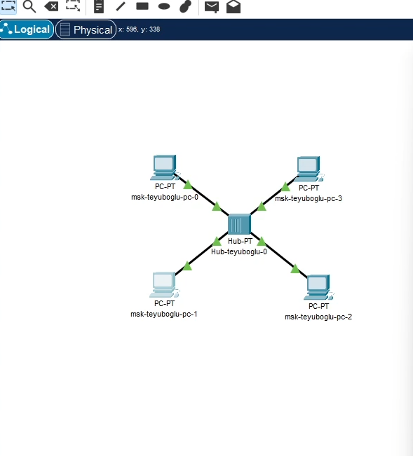{#fig:001 width=70%}

## Статические IP

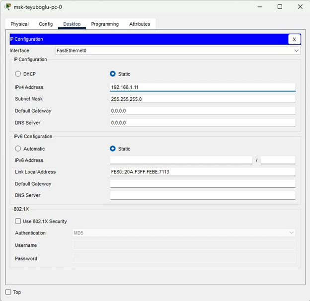{#fig:002 width=70%}

## Режим симуляции

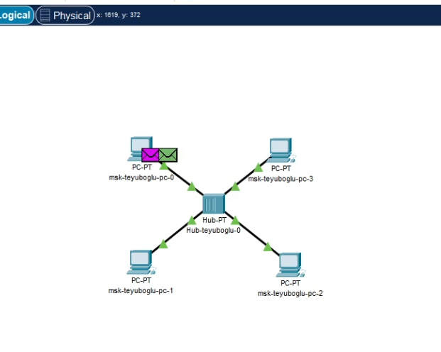{#fig:003 width=70%}

## PDU Details

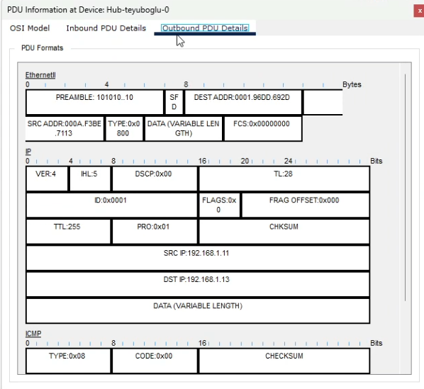{#fig:004 width=70%}

## Проверь себя

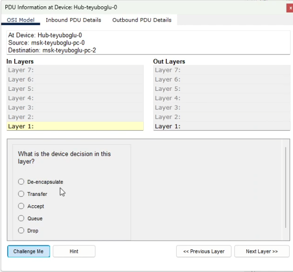{#fig:005 width=70%}

## Коллизия

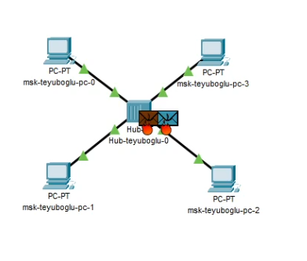{#fig:006 width=70%}

## Добавляем коммутатор и 4 оконеченных устройства

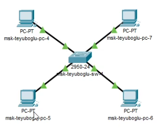{#fig:007 width=70%}

## Статические IP

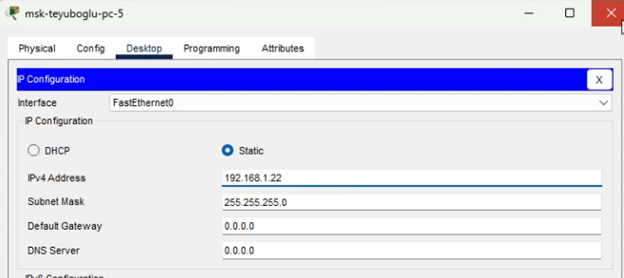{#fig:008 width=70%}

## Режим симуляции

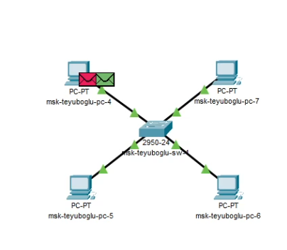{#fig:009 width=70%}

## Смотрим информацию PDU

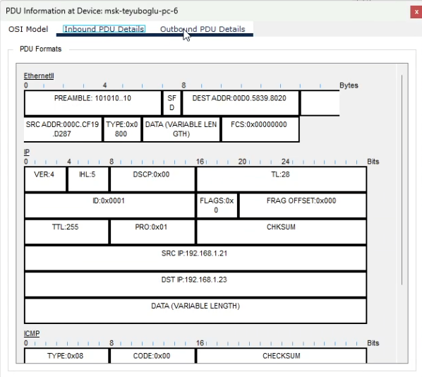{#fig:010 width=70%}

## Режим симуляции PC4 -> PC6 PC6 -> PC4

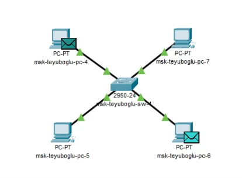{#fig:011 width=70%}

## Соединяем коммутатор и хаб

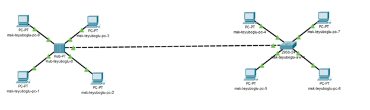{#fig:012 width=70%}

## Режим симуляции

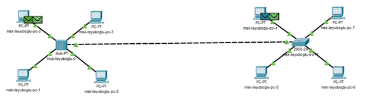{#fig:013 width=70%}

## Образование коллизии

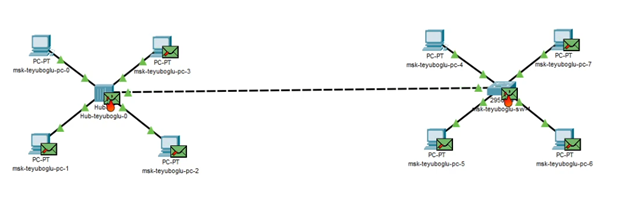{#fig:014 width=70%}

## STP пакет

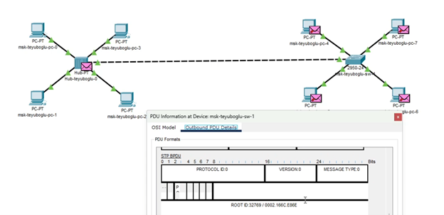{#fig:015 width=70%}

## Добавляем маршрутизатор 

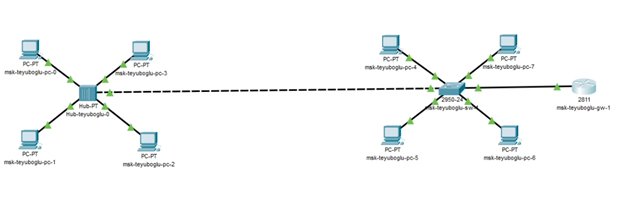{#fig:016 width=70%}

## Активация порта

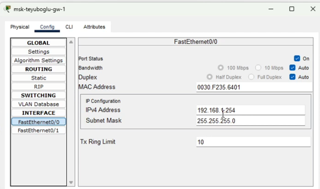{#fig:017 width=70%}

## CDP пакет

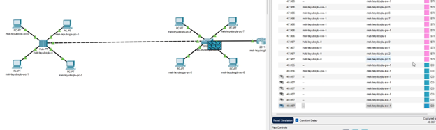{#fig:018 width=70%}

# Выводы по проделанной работе

## Выводы

Благодаря выполнению данной лабораторной работы мы установили инструменты моделирования конфигурации сети Cisco Packet Tracer и познакомились с его интерфейсом.
