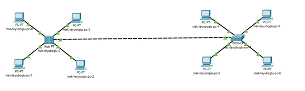

---
## Front matter
title: "Лабораторная работа №1"
subtitle: "Знакомство с Cisco Packet Tracer"
author: "Еюбоглу Тимур"

## Generic otions
lang: ru-RU
toc-title: "Содержание"

## Bibliography
bibliography: bib/cite.bib
csl: pandoc/csl/gost-r-7-0-5-2008-numeric.csl

## Pdf output format
toc: true # Table of contents
toc-depth: 2
lof: true # List of figures
lot: true # List of tables
fontsize: 12pt
linestretch: 1.5
papersize: a4
documentclass: scrreprt
## I18n polyglossia
polyglossia-lang:
  name: russian
  options:
  - spelling=modern
  - babelshorthands=true
polyglossia-otherlangs:
  name: english
## I18n babel
babel-lang: russian
babel-otherlangs: english
## Fonts
mainfont: IBM Plex Serif
romanfont: IBM Plex Serif
sansfont: IBM Plex Sans
monofont: IBM Plex Mono
mathfont: STIX Two Math
mainfontoptions: Ligatures=Common,Ligatures=TeX,Scale=0.94
romanfontoptions: Ligatures=Common,Ligatures=TeX,Scale=0.94
sansfontoptions: Ligatures=Common,Ligatures=TeX,Scale=MatchLowercase,Scale=0.94
monofontoptions: Scale=MatchLowercase,Scale=0.94,FakeStretch=0.9
mathfontoptions:
## Biblatex
biblatex: true
biblio-style: "gost-numeric"
biblatexoptions:
  - parentracker=true
  - backend=biber
  - hyperref=auto
  - language=auto
  - autolang=other*
  - citestyle=gost-numeric
## Pandoc-crossref LaTeX customization
figureTitle: "Рис."
tableTitle: "Таблица"
listingTitle: "Листинг"
lofTitle: "Список иллюстраций"
lotTitle: "Список таблиц"
lolTitle: "Листинги"
## Misc options
indent: true
header-includes:
  - \usepackage{indentfirst}
  - \usepackage{float} # keep figures where there are in the text
  - \floatplacement{figure}{H} # keep figures where there are in the text
---

# Цель работы

Установка инструмента моделирования конфигурации сети Cisco Packet Tracer [3], знакомство с его интерфейсом.

# Задание

1. Установить на домашнем устройстве Cisco Packet Tracer.
2. Постройте простейшую сеть в Cisco Packet Tracer, проведите простейшую настройку оборудования.

# Выполнение лабораторной работы

1. 1. Создайте новый проект (например, lab_PT-01.pkt).
2. В рабочем пространстве разместите концентратор (Hub-PT) и четыре оконечных устройства PC. Соедините оконечные устройства с концентратором прямым кабелем (рис. 1.3). Щёлкнув последовательно на каждом оконечном устройстве, задайте статические IP-адреса 192.168.1.11, 192.168.1.12, 192.168.1.13, 192.168.1.14 с маской подсети 255.255.255.0 (рис. 1.4).(рис. [-@fig:001]) (рис. [-@fig:002]) (рис. [-@fig:003]) (рис. [-@fig:004]) (рис. [-@fig:005]).

{#fig:001 width=80%}

{#fig:002 width=80%}

{#fig:003 width=80%}

{#fig:004 width=80%}

{#fig:005 width=80%}

3. В основном окне проекта перейдите из режима реального времени (Realtime) в режим моделирования (Simulation). Выберите на панели инструментов мышкой «Add Simple PDU (P)» и щёлкните сначала на PC0, затем на PC2. В рабочей области должны будут появится два конверта, обозначающих пакеты, в списке событий на панели моделирования должны будут появиться два события, относящихся к пакетам ARP и ICMP соответственно (рис. 1.5). На панели моделирования нажмите кнопку «Play» и проследите за движением пакетов ARP и ICMP от устройства PC0 до устройства PC2 и обратно. (рис. [-@fig:006])

{#fig:006 width=80%}

4. Щёлкнув на строке события, откройте окно информации о PDU и изучите, что происходит на уровне модели OSI при перемещении пакета (рис. 1.6). Используя кнопку «Проверь себя» (Challenge Me) на вкладке OSI Model, ответьте на вопросы. 
5. Откройте вкладку с информацией о PDU (рис. 1.7). Исследуйте структуру пакета ICMP. Опишите структуру кадра Ethernet. Какие изменения происходят в кадре Ethernet при передвижении пакета? Какой тип имеет кадр Ethernet? Опишите структуру MAC-адресов.(рис. [-@fig:007]) (рис. [-@fig:008]).

{#fig:007 width=80%}

{#fig:008 width=80%}

6. Очистите список событий, удалив сценарий моделирования. Выберите на панели инструментов мышкой «Add Simple PDU (P)» и щёлкните сначала на PC0, затем на PC2. Снова выберите на панели инструментов мышкой «Add Simple PDU (P)» и щёлкните сначала на PC2, затем на PC0. На панели моделирования нажмите кнопку «Play» и проследите за возникновением коллизии (рис. 1.8). В списке событий посмотрите информацию о PDU. В отчёте поясните, как отображается в заголовках пакетов информация о коллизии и почему возникла коллизия (рис. [-@fig:009]).

{#fig:009 width=80%}

7. Перейдите в режим реального времени (Realtime). В рабочем пространстве разместите коммутатор (например Cisco 2950-24) и 4 оконечных устройства PC. Соедините оконечные устройства с коммутатором прямым кабелем. Щёлкнув последовательно на каждом оконечном устройстве, задайте статические IP-адреса 192.168.1.21, 192.168.1.22, 192.168.1.23, 192.168.1.24 с маской подсети 255.255.255.0. (рис. [-@fig:010]) (рис. [-@fig:011]) (рис. [-@fig:012]) (рис. [-@fig:013]) (рис. [-@fig:014]).

{#fig:010 width=80%}

{#fig:011 width=80%}

{#fig:012 width=80%}

{#fig:013 width=80%}

{#fig:014 width=80%}

8. В основном окне проекта перейдите из режима реального времени (Realtime) в режим моделирования (Simulation). Выберите на панели инструментов мышкой «Add Simple PDU (P)» и щёлкните сначала на PC4, затем на PC6. В рабочей области должны будут появится два конверта, обозначающих пакеты, в списке событий на панели моделирования должны будут появиться два события, относящихся к пакетам ARP и ICMP соответственно (рис. 1.9). На панели моделирования нажмите кнопку «Play» и проследите за движением пакетов ARP и ICMP от устройства PC4 до устройства PC6 и обратно. В отчёте поясните, есть ли различия и в чём они заключаются в событиях протокола ARP в сценарии с концентратором. 
9. Исследуйте структуру пакета ICMP. Опишите структуру кадра Ethernet. Какие изменения происходят в кадре Ethernet при передвижении пакета? Какой тип имеет кадр Ethernet? Опишите структуру MAC-адресов.(рис. [-@fig:015]) (рис. [-@fig:016]).

{#fig:015 width=80%}

{#fig:016 width=80%}

10. Очистите список событий, удалив сценарий моделирования. Выберите на панели инструментов мышкой «Add Simple PDU (P)» и щёлкните сначала на PC4, затем на PC6. Снова выберите на панели инструментов мышкой «Add Simple PDU (P)» и щёлкните сначала на PC6, затем на PC4. На панели моделирования нажмите кнопку «Play» и проследите за движением пакетов. В отчёте поясните, почему не возникает коллизия. (рис. [-@fig:017]).

{#fig:017 width=80%}

11. Перейдите в режим реального времени (Realtime). В рабочем пространстве соедините кроссовым кабелем концентратор и коммутатор. Перейдите в режим моделирования (Simulation). Очистите список событий, удалив сценарий моделирования. Выберите на панели инструментов мышкой «Add Simple PDU (P)» и щёлкните сначала на PC0, затем на PC4. Снова выберите на панели инструментов мышкой «Add Simple PDU (P)» и щёлкните сначала на PC4, затем на PC0. На панели моделирования нажмите кнопку «Play» и проследите за движением пакетов. В отчёте поясните, почему сначала возникает коллизия (рис. 1.10), а затем пакеты успешно достигают пункта назначения. (рис. [-@fig:018]) (рис. [-@fig:019]) (рис. [-@fig:020]).

{#fig:018 width=80%}

{#fig:019 width=80%}

{#fig:020 width=80%}

12. Очистите список событий, удалив сценарий моделирования. На панели моделирования нажмите «Play» и в списке событий получите пакеты STP (рис. 1.11). Исследуйте структуру STP. Опишите структуру кадра Ethernet в этих пакетах. Какой тип имеет кадр Ethernet? Опишите структуру MACадресов. (рис. [-@fig:021]).

{#fig:021 width=80%}

13. Перейдите в режим реального времени (Realtime). В рабочем пространстве добавьте маршрутизатор (например, Cisco 2811). Соедините прямым кабелем коммутатор и маршрутизатор (рис. 1.12). Щёлкните на маршрутизаторе и на вкладке его конфигурации пропишите статический IP-адрес 192.168.1.254 с маской 255.255.255.0, активируйте порт, поставив галочку «On» напротив «Port Status» (рис. 1.13). (рис. [-@fig:022]) (рис. [-@fig:023]).

{#fig:022 width=80%}

{#fig:023 width=80%}

14. Перейдите в режим моделирования (Simulation). Очистите список событий, удалив сценарий моделирования. Выберите на панели инструментов мышкой «Add Simple PDU (P)» и щёлкните сначала на PC3, затем на маршрутизаторе. На панели моделирования нажмите кнопку «Play» и проследите за движением пакетов ARP, ICMP, STP и CDP. Исследуйте структуру пакета CDP, опишите структуру кадра Ethernet. Какой тип имеет кадр Ethernet? Опишите структуру MAC-адресов. (рис. [-@fig:024]).

{#fig:024 width=80%}

# Контрольные вопросы

1. Дайте определение следующим понятиям: концентратор, коммутатор, маршрутизатор, шлюз (gateway). В каких случаях следует использовать тот или иной тип сетевого оборудования?

Концентратор (Hub): концентратор является устройством, которое принимает данные с одного устройства сети и передает их всем остальным устройствам в сети.
Он работает на физическом уровне модели OSI (Open Systems Interconnection), просто усиливая сигнал и передавая его по всем портам. 
Концентратор не имеет интеллекта для анализа данных или управления трафиком. Обычно используется в небольших сетях или для расширения количества портов в сети.

Коммутатор (Switch): коммутатор также работает на канальном уровне OSI и способен анализировать адреса MAC (Media Access Control) устройств, подключенных к нему.
В отличие от концентратора, коммутатор передает данные только тому устройству, для которого они предназначены, что делает его более эффективным по сравнению с концентратором.

Коммутаторы обычно используются в сетях с высокой пропускной способностью, где требуется эффективное управление трафиком и безопасностью.
Маршрутизатор (Router): маршрутизатор работает на сетевом уровне OSI и способен анализировать IP-адреса устройств в сети. Он принимает решения о передаче данных между различными сетями на основе IP-адресации и информации о маршрутах.
Маршрутизаторы используются для соединения различных сетей (например, локальной сети и Интернета) и обеспечения маршрутизации данных между ними.

Шлюз (Gateway): шлюз - это устройство, которое соединяет различные сети с разными протоколами, форматами данных или архитектурой.
В контексте сетей Шлюз часто используется как точка доступа к другой сети, например, для доступа к Интернету из локальной сети. Шлюз выполняет преобразование данных и управляет коммуникацией между разными сетями. В зависимости от конкретного применения, шлюз может быть представлен как программное или аппаратное оборудование. Выбор типа сетевого оборудования зависит от конкретных потребностей сети: Для простых сетей малого размера без особых требований к управлению трафиком можно использовать концентраторы. Для сетей среднего и большого размера, где требуется управление трафиком и безопасность, рекомендуется использовать коммутаторы. Для подключения сетей различных типов и обеспечения маршрутизации данных между ними необходимы маршрутизаторы. Шлюзы используются там, где требуется соединение сетей с разными протоколами или доступ к внешним сетям, таким как Интернет.

2. Дайте определение следующим понятиям: ip-адрес, сетевая маска, broadcast адрес.
IP-адрес (Internet Protocol Address): IP-адрес - это числовая метка, присвоенная каждому устройству в компьютерной сети, использующей протокол Интернета (IP). Он используется для идентификации и адресации устройств в сети, позволяя маршрутизаторам правильно направлять пакеты данных к их назначению. IP-адрес состоит из 32 бит (для IPv4) или 128 бит (для IPv6) и представляется в виде четырех чисел, разделенных точками (для IPv4) или в виде группы шестнадцатеричных чисел, разделенных двоеточиями (для IPv6). 
Сетевая маска (Network Mask): сетевая маска используется для определения, какая часть IP-адреса относится к сети, а какая - к узлу в этой сети. Она представляет собой набор битов, который определяет количество битов, зарезервированных для идентификации сети, в IP-адресе. Обычно сетевая маска записывается вместе с IP-адресом, используя формат, подобный "192.168.1.0/24", где /24 указывает на количество битов, отведенных для сети.
Broadcast-адрес: Broadcast-адрес - это специальный адрес в сети, который используется для отправки данных всем устройствам в этой сети. Когда устройство отправляет пакет данных на broadcast-адрес, все устройства в этой сети получают этот пакет. Broadcast-адрес для IPv4 обычно имеет значение, в котором все биты хоста установлены в 1, например, для сети 192.168.1.0 с сетевой маской /24 broadcast-адрес будет 192.168.1.255. Для IPv6 broadcast-адреса не существует, вместо этого используется multicast для доставки данных на несколько устройств.

3. Как можно проверить доступность узла сети?
Ping (ICMP Echo Request): Ping - это самый распространенный способ проверки доступности узла. Это делается отправкой ICMP (Internet Control Message Protocol) Echo Request пакета на IP-адрес узла и ожиданием ответа. Если узел доступен, он отправит обратно ICMP Echo Reply пакет Traceroute (или traceroute6 для IPv6): Этот инструмент используется для определения маршрута, который пакеты данных пройдут от отправителя до получателя. Он посылает серию пакетов с увеличивающимся TTL (Time-to-Live) и анализирует ответы для определения промежуточных узлов. Это позволяет выявить места, где возникают проблемы в маршрутизации. Проверка порта (Port Scan): Если вам нужно не только убедиться, что узел отвечает на пинг, но и проверить, работает ли на нем конкретное сетевое приложение, вы можете выполнить сканирование портов. Существуют различные инструменты, такие как Nmap, которые позволяют сканировать порты на удаленном узле и определить, какие порты открыты и доступны для подключения. Использование специализированных сетевых инструментов: Существует множество специализированных инструментов для управления сетями, которые предоставляют информацию о доступности узлов, их статусе и производительности. Это могут быть мониторинговые системы, такие как Zabbix, Nagios, Prometheus, или программное обеспечение от производителей сетевого оборудования. Использование интерфейсов управления сетевым оборудованием: Многие сетевые устройства предоставляют интерфейсы управления или CLI (Command Line Interface), через которые можно проверить доступность узлов в сети, например, используя команды ping или traceroute на маршрутизаторе. Выбор метода зависит от конкретных требований и характеристик вашей сетевой инфраструктуры.

# Выводы

Благодаря выполнению данной лабораторной работы мы установили инструменты моделирования конфигурации сети Cisco Packet Tracer и познакомились с его интерфейсом.