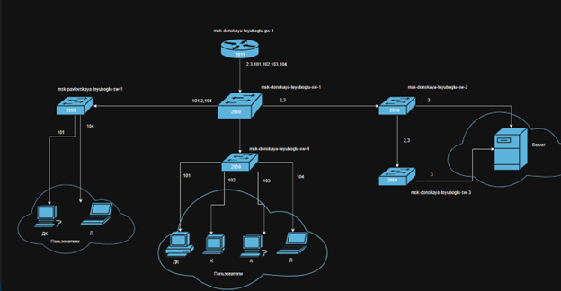
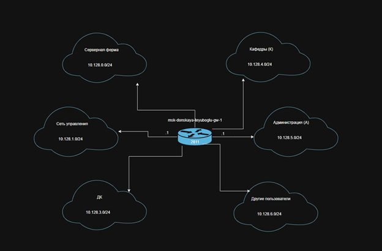
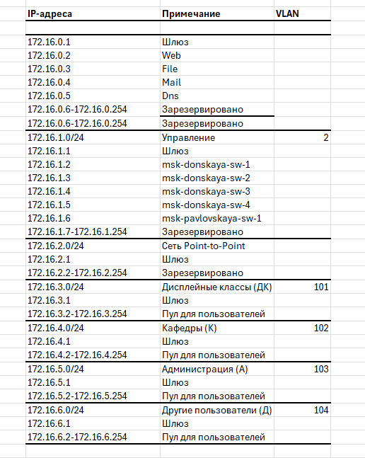
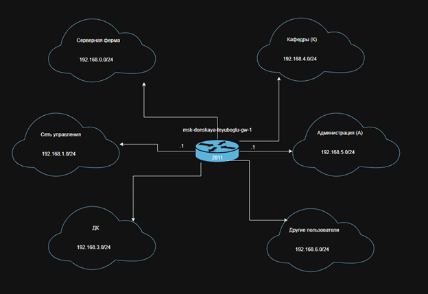
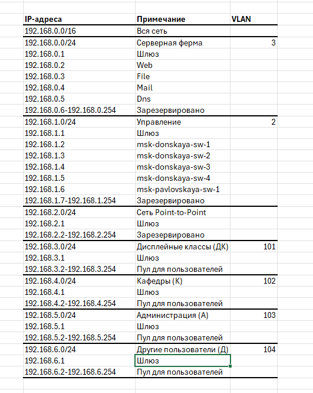

---
## Front matter
title: "Лабораторная работа №3"
subtitle: "Планирование локальной сети организации"
author: "Еюбоглу Тимур"

## Generic otions
lang: ru-RU
toc-title: "Содержание"

## Bibliography
bibliography: bib/cite.bib
csl: pandoc/csl/gost-r-7-0-5-2008-numeric.csl

## Pdf output format
toc: true # Table of contents
toc-depth: 2
lof: true # List of figures
lot: true # List of tables
fontsize: 12pt
linestretch: 1.5
papersize: a4
documentclass: scrreprt
## I18n polyglossia
polyglossia-lang:
  name: russian
  options:
  - spelling=modern
  - babelshorthands=true
polyglossia-otherlangs:
  name: english
## I18n babel
babel-lang: russian
babel-otherlangs: english
## Fonts
mainfont: IBM Plex Serif
romanfont: IBM Plex Serif
sansfont: IBM Plex Sans
monofont: IBM Plex Mono
mathfont: STIX Two Math
mainfontoptions: Ligatures=Common,Ligatures=TeX,Scale=0.94
romanfontoptions: Ligatures=Common,Ligatures=TeX,Scale=0.94
sansfontoptions: Ligatures=Common,Ligatures=TeX,Scale=MatchLowercase,Scale=0.94
monofontoptions: Scale=MatchLowercase,Scale=0.94,FakeStretch=0.9
mathfontoptions:
## Biblatex
biblatex: true
biblio-style: "gost-numeric"
biblatexoptions:
  - parentracker=true
  - backend=biber
  - hyperref=auto
  - language=auto
  - autolang=other*
  - citestyle=gost-numeric
## Pandoc-crossref LaTeX customization
figureTitle: "Рис."
tableTitle: "Таблица"
listingTitle: "Листинг"
lofTitle: "Список иллюстраций"
lotTitle: "Список таблиц"
lolTitle: "Листинги"
## Misc options
indent: true
header-includes:
  - \usepackage{indentfirst}
  - \usepackage{float} # keep figures where there are in the text
  - \floatplacement{figure}{H} # keep figures where there are in the text
---

# Цель работы

Познакомиться с принципами планирования локальной сети организации.

# Выполнение лабораторной работы

Используя графический редактор (Dia), повторим схемы L1 (Рис. 1.1), L2 (Рис. 1.2), L3 (Рис. 1.3), а также сопутствующие им таблицы VLAN (Рис. 1.4), IPадресов (Рис. 1.5) и ё портов подключения оборудования планируемой сети (Рис. 1.6): (рис. [-@fig:001]) (рис. [-@fig:002]) (рис. [-@fig:003]) (рис. [-@fig:004]) (рис. [-@fig:005]) (рис. [-@fig:006]) .

{#fig:001 width=80%}

{#fig:002 width=80%}

{#fig:003 width=80%}

{#fig:004 width=80%}

{#fig:005 width=80%}

{#fig:006 width=80%}

Теперь сделаем аналогичный план адресного пространства для сетей 172.16.0.0/12 (Рис. 2.1 – 2.6) и 192.168.0.0/16 (Рис. 2.7 – 2.12) с соответствующими схемами сети (L1, L2, L3) и сопутствующими таблицами VLAN, IP-адресов и портов подключения оборудования: (рис. [-@fig:007]) (рис. [-@fig:008]) (рис. [-@fig:009]) (рис. [-@fig:010]) (рис. [-@fig:011])  (рис. [-@fig:012]) (рис. [-@fig:013]) (рис. [-@fig:014]) (рис. [-@fig:015]) (рис. [-@fig:016]) (рис. [-@fig:017])  (рис. [-@fig:018]).

{#fig:007 width=80%}

{#fig:008 width=80%}

{#fig:009 width=80%}

{#fig:010 width=80%}

{#fig:011 width=80%}

{#fig:012 width=80%}

{#fig:013 width=80%}

{#fig:014 width=80%}

{#fig:015 width=80%}

{#fig:016 width=80%}

{#fig:017 width=80%}

{#fig:018 width=80%}

# Контрольные вопросы

1. Что такое модель взаимодействия открытых систем (OSI)? Какие уровни в ней есть? Какие функции закреплены за каждым уровнем модели OSI? – 
Модель взаимодействия открытых систем (Open Systems Interconnection, OSI) — это стандартная модель, предложенная Международной организацией по стандартизации (ISO), которая описывает, как компьютерные системы должны взаимодействовать друг с другом. Она разделяет процесс коммуникации на семь уровней, каждый из которых отвечает за определенные функции.
Вот краткое описание каждого уровня модели OSI и его функций:
• Физический уровень (Physical Layer): передача битов по физической среде.
• Канальный уровень (Data Link Layer): обеспечивает безошибочную передачу данных между соседними устройствами через общую среду передачи.
• Сетевой уровень (Network Layer): занимается маршрутизацией и пересылкой пакетов данных через несколько сетей.
• Транспортный уровень (Transport Layer): обеспечивает надежную передачу данных между узлами в сети. 
• Сеансовый уровень (Session Layer): устанавливает, поддерживает и завершает соединения между двумя узлами в сети.
• Представительный уровень (Presentation Layer):обеспечивает структурирование и кодирование данных перед их передачей.
• Прикладной уровень (Application Layer): предоставляет интерфейс для прикладных программ. Модель OSI помогает стандартизировать процесс взаимодействия между различными системами, что упрощает разработку сетевых приложений и обеспечивает их совместимость.
2. Какие функции выполняет коммутатор? - 
Коммутатор (switch) — это сетевое устройство, которое играет важную роль в локальной компьютерной сети (LAN). Его основная функция заключается в пересылке данных между устройствами в сети, обеспечивая эффективную и надежную передачу информации. Вот основные функции, которые выполняет коммутатор:
• Пересылка кадров (Frame forwarding)
• Фильтрация и обучение (Filtering and Learning)
• Управление коллизиями (Collision Management)
• Управление потоком (Flow Control)
• Дуплексный режим (Duplex Mode Management)
3. Какие функции выполняет маршрутизатор? - Маршрутизатор (router)
- это сетевое устройство, которое работает на сетевом уровне (сетевой уровень OSI модели) и обеспечивает передачу данных между различными сегментами сети, используя информацию о маршрутах. Вот основные функции, которые выполняет маршрутизатор:
• Маршрутизация (Routing)
• Перенаправление (Forwarding)
• Фильтрация трафика (Traffic Filtering)
• Адресация (Addressing)
• Управление полосой пропускания (Bandwidth Management)
• Сегментация сети (Network Segmentation)
4. В чём отличие коммутаторов третьего уровня от коммутаторов второго уровня? - 
Отличие между коммутаторами второго и третьего уровня связано с уровнем, на котором они работают в сетевой модели OSI, а также с функциональностью и способностью обрабатывать данные.
5. Что такое сетевой интерфейс? - 
Сетевой интерфейс (Network Interface) представляет собой физическое или логическое устройство, которое позволяет компьютеру или другому сетевому устройству подключаться к сети для обмена данными. Сетевой интерфейс обеспечивает связь между устройством и сетью, позволяя передавать данные внутри и между сетями.
6. Что такое сетевой порт? - 
Сетевой порт (Network port) — это числовая адресная точка в компьютерной сети, которая используется для идентификации конкретного процесса или службы на устройстве в сети. Порты позволяют множеству приложений и служб работать параллельно на одном устройстве, обеспечивая таким образом многопроцессорный и многопользовательский доступ к ресурсам сети.
7. Кратко охарактеризуйте технологии Ethernet, Fast Ethernet, Gigabit
Ethernet. -
• Ethernet - это стандартная технология локальных сетей (LAN), которая предоставляет возможность передачи данных по сетевым кабелям. Он работает на скоростях до 10 Мбит/с и использует различные типы кабелей, такие как коаксиальный кабель (10BASE5), витая пара (10BASE-T) и оптоволокно (10BASE-F). Ethernet был первоначально стандартизирован в IEEE 802.3 и стал доминирующим стандартом для проводных локальных сетей.
• Fast Ethernet - это улучшенная версия технологии Ethernet, которая поддерживает скорости передачи данных до 100 Мбит/с. Он использует те же типы кабелей, что и Ethernet, но с повышенной скоростью передачи данных. Fast Ethernet был стандартизирован в IEEE 802.3u и быстро стал популярным выбором для более быстрых сетей в домашних и офисных средах.
• Gigabit Ethernet - это следующий этап развития Ethernet, предоставляющий скорости передачи данных до 1 Гбит/с. Он использует высокоскоростные варианты витой пары (1000BASE-T) или оптоволокна (1000BASE-X) для обеспечения более высокой пропускной способности. Gigabit Ethernet часто используется в корпоративных сетях и датацентрах для обеспечения высокой производительности и скорости обмена данными между устройствами.
8. Что такое IP-адрес (IPv4-адрес)? Определите понятия сеть, подсеть, маска подсети. Охарактеризуйте служебные IP-адреса. Приведите пример с пояснениями разбиения сети на две или более подсетей с указанием числа узлов в каждой подсети. -
• IP-адрес (Internet Protocol Address) - это числовой идентификатор, присваиваемый каждому устройству в компьютерной сети, подключенной к сети, использующей протокол IPv4. IPv4-адрес состоит из четырех октетов (байтов), разделенных точками, каждый из которых может принимать значения от 0 до 255. Например, 192.168.1.1.
• Сеть - это группа компьютеров и других устройств, соединенных между собой для обмена данными и ресурсами. Каждое устройство в сети имеет свой собственный IP-адрес,который позволяет ему уникально идентифицироваться в сети.
• Подсеть (Subnet) - это логический сегмент сети, который образуется путем разделения основной сети на более мелкие части для управления трафиком и повышения безопасности сети.
• Маска подсети (Subnet Mask) - это 32-битовое значение, используемое для определения размера сети и подсети. Маска подсети указывает, какая часть IP-адреса относится к сети, а какая к узлам в этой сети. Она состоит из последовательности единиц, за которыми следуют нули. Например, 255.255.255.0.
• Служебные IP-адреса - это специальные адреса, зарезервированные для определенных целей в сети. Они не используются для назначения устройствам в сети и предназначены для определенных служб или целей, таких как тестирование, маршрутизация, широковещательные и многоадресные коммуникации. Пример разбиения сети на две подсети с указанием числа узлов в каждой подсети: Предположим, у нас есть сеть с IP-адресом 192.168.1.0 и маской подсети 255.255.255.0 (24 бита для сети и 8 битов для узлов). Мы хотим разбить эту сеть на две подсети с равным количеством узлов. Мы можем использовать маску подсети 255.255.255.128 (или /25), что означает, что у нас есть 7 битов для узлов (2^7 = 128) и 1 бит для подсети. Таким образом, у нас есть две подсети:
Подсеть 1:
• IP-адрес: 192.168.1.0
• Маска подсети: 255.255.255.128
• Диапазон адресов: 192.168.1.1 - 192.168.1.126 (126 узлов)
• Broadcast адрес: 192.168.1.127
Подсеть 2:
• IP-адрес: 192.168.1.128
• Маска подсети: 255.255.255.128
• Диапазон адресов: 192.168.1.129 - 192.168.1.254 (126 узлов)
• Broadcast адрес: 192.168.1.255
Таким образом, мы разбили исходную сеть на две подсети с равным количеством узлов.
9. Дайте определение понятию VLAN. Для чего применяется VLAN в сети организации? Какие преимущества даёт применение VLAN в сети организации? Приведите примеры разных ситуаций. - 
VLAN (Virtual Local Area Network) - это логическая сеть, которая создается внутри физической сети с целью разделения устройств на разные группы, независимо от их физического расположения в сети. Устройства в одной VLAN могут обмениваться данными как  внутри VLAN, так и с устройствами в других VLAN, в зависимости от настроек маршрутизации или коммутации. Применение VLAN в сети организации:
• Сегментация сети: позволяет разделить сеть на логические сегменты согласно функциональным, безопасностным или организационным потребностям.
• Управление трафиком: позволяет администраторам сети управлять трафиком, применяя политики безопасности, качества обслуживания (QoS) и т. д.
• Улучшенная безопасность: позволяет разделить чувствительные данные и сервисы от общего трафика в сети, улучшая безопасность и предотвращая несанкционированный доступ к данным.
• Оптимизация ресурсов: позволяет оптимизировать использование сетевых ресурсов, направляя трафик только туда, где он необходим, и уменьшая перегрузку сети. Преимущества применения VLAN в сети организации:
• Гибкость и масштабируемость: возможность быстро изменять конфигурацию сети, добавлять или удалять VLAN в зависимости от потребностей организации.
• Улучшенная безопасность: возможность физической и логической изоляции сетевых сегментов, что усиливает безопасность и защищает от атак.
• Эффективное использование ресурсов: возможность оптимизации сетевых ресурсов и уменьшения нагрузки на сеть за счет лучшего управления трафиком.
• Улучшенное управление: централизованное управление и настройка VLAN облегчает администрирование сети и обеспечивает более гибкие возможности управления сетью.
Примеры ситуаций применения VLAN:
• Разделение отделов: создание VLAN для разных отделов организации (например, финансового, маркетингового, технического) для логического разделения сетевых ресурсов и безопасности данных.
• Гостевая сеть: создание VLAN для гостевого Wi-Fi, чтобы отделить трафик гостевых пользователей от внутренней сети
компании.
• Группировка устройств: группировка сетевых устройств с общими потребностями (например, серверов, IP-телефонов, видеокамер) в отдельные VLAN для оптимизации трафика и улучшения производительности.
• Сегментация по безопасности: создание отдельной VLAN для сегментации трафика с целью улучшения безопасности и защиты критически важных сетевых ресурсов.

10.В чём отличие Trunk Port от Access Port? - 
Trunk Port и Access Port -  это два типа портов на коммутаторах, используемых в сетевых конфигурациях. Они имеют разные функции и настройки.
• Access Port предназначен для подключения устройств конечных пользователей, таких как компьютеры, принтеры или IP-телефоны.
• Trunk Port используется для соединения между коммутаторами или между коммутатором и маршрутизатором.
Отличие между Trunk Port и Access Port:
Трафик:
• Access Port передает трафик только одной VLAN, к которой он принадлежит.
• Trunk Port передает трафик с нескольких VLAN через один порт.
Назначение:
• Access Port предназначен для подключения конечных устройств пользователей к сети.
• Trunk Port используется для соединения коммутаторов и передачи трафика между ними, а также для подключения к маршрутизаторам.
Настройка:
• Access Port настраивается для принадлежности к определенной VLAN.
• Trunk Port настраивается для передачи трафика с нескольких VLAN и может быть настроен для передачи всех или определенных VLAN

# Выводы

Благодаря выполнению данной лабораторной работы, мы познакомились с принципами планирования локальной сети организации.