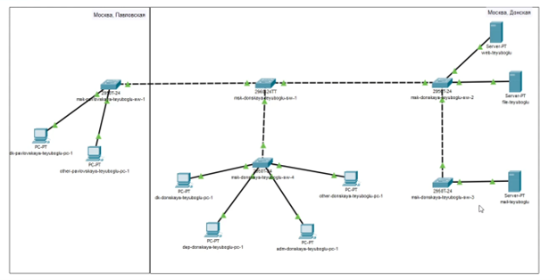
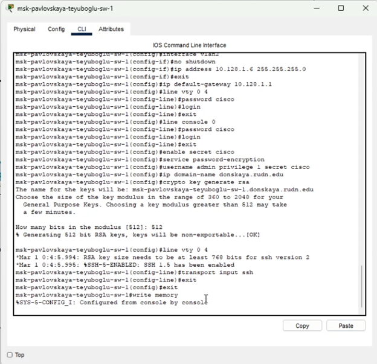
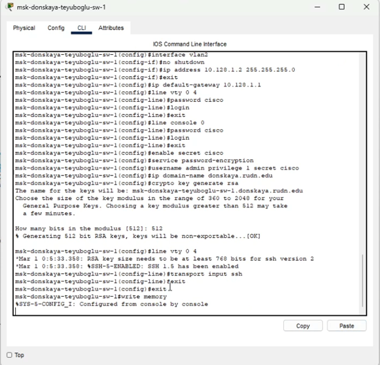
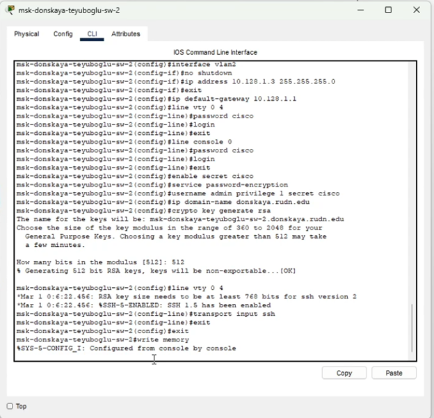
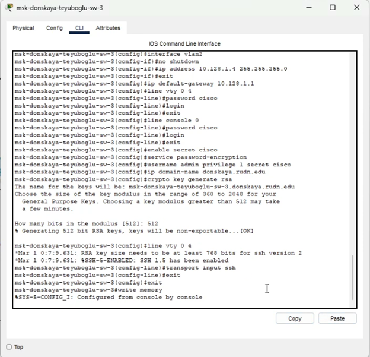
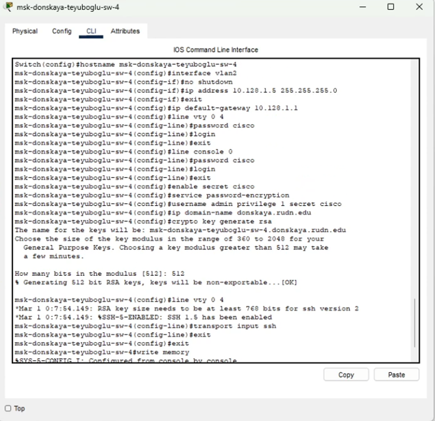

---
## Front matter
title: "Лабораторная работа №4"
subtitle: "Первоначальное конфигурирование сети"
author: "Еюбоглу Тимур"

## Generic otions
lang: ru-RU
toc-title: "Содержание"

## Bibliography
bibliography: bib/cite.bib
csl: pandoc/csl/gost-r-7-0-5-2008-numeric.csl

## Pdf output format
toc: true # Table of contents
toc-depth: 2
lof: true # List of figures
lot: true # List of tables
fontsize: 12pt
linestretch: 1.5
papersize: a4
documentclass: scrreprt
## I18n polyglossia
polyglossia-lang:
  name: russian
  options:
  - spelling=modern
  - babelshorthands=true
polyglossia-otherlangs:
  name: english
## I18n babel
babel-lang: russian
babel-otherlangs: english
## Fonts
mainfont: IBM Plex Serif
romanfont: IBM Plex Serif
sansfont: IBM Plex Sans
monofont: IBM Plex Mono
mathfont: STIX Two Math
mainfontoptions: Ligatures=Common,Ligatures=TeX,Scale=0.94
romanfontoptions: Ligatures=Common,Ligatures=TeX,Scale=0.94
sansfontoptions: Ligatures=Common,Ligatures=TeX,Scale=MatchLowercase,Scale=0.94
monofontoptions: Scale=MatchLowercase,Scale=0.94,FakeStretch=0.9
mathfontoptions:
## Biblatex
biblatex: true
biblio-style: "gost-numeric"
biblatexoptions:
  - parentracker=true
  - backend=biber
  - hyperref=auto
  - language=auto
  - autolang=other*
  - citestyle=gost-numeric
## Pandoc-crossref LaTeX customization
figureTitle: "Рис."
tableTitle: "Таблица"
listingTitle: "Листинг"
lofTitle: "Список иллюстраций"
lotTitle: "Список таблиц"
lolTitle: "Листинги"
## Misc options
indent: true
header-includes:
  - \usepackage{indentfirst}
  - \usepackage{float} # keep figures where there are in the text
  - \floatplacement{figure}{H} # keep figures where there are in the text
---

# Цель работы

Провести подготовительную работу по первоначальной настройке коммутаторов сети.

# Выполнение лабораторной работы

1. В логической рабочей области Packet Tracer разместим коммутаторы и оконечные устройства согласно схеме сети L1 (схема приведена в лабораторной работе) и соединим их через соответствующие интерфейсы (Рис. 1.2):(рис. [-@fig:001]).

{#fig:001 width=80%}

2. Используя типовую конфигурацию коммутатора, настроем все коммутаторы, изменяя название устройства и его IP-адрес согласно плану IP (Рис. 1.3 – 1.7): (рис. [-@fig:002]) (рис. [-@fig:003]) (рис. [-@fig:004]) (рис. [-@fig:005]) (рис. [-@fig:006]).

{#fig:002 width=80%}

{#fig:003 width=80%}

{#fig:004 width=80%}

{#fig:005 width=80%}

{#fig:006 width=80%}

# Контрольные вопросы

1. При помощи каких команд можно посмотреть конфигурацию сетевого оборудования? -

show running-config

2. При помощи каких команд можно посмотреть стартовый конфигурационный файл оборудования? - 

show startup-config

3. При помощи каких команд можно экспортировать конфигурационный файл оборудования? - 

copy running-config startup-config/copy running-config flash

4. При помощи каких команд можно импортировать конфигурационный файл оборудования? - 

copy startup-config running-config

# Выводы

Благодаря выполнению данной лабораторной работы, мы провели подготовительную работу по первоначальной настройке коммутаторов сети.