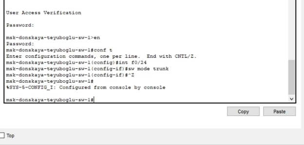
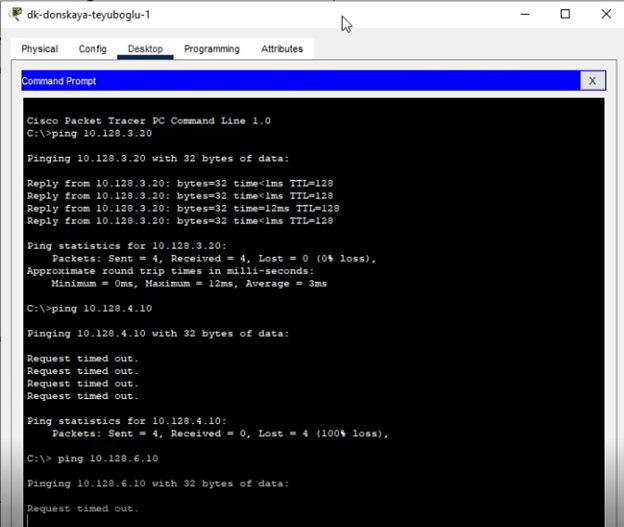
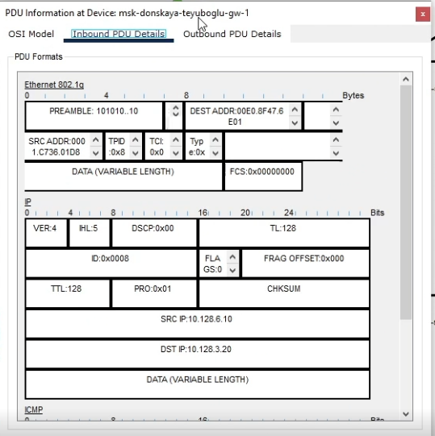

## Докладчик

* Еюбоглу Тимур
* 1032224357
* уч. группа: НПИбд-01-22
* Факультет физико-математических и естественных наук
* Российский университет дружбы народов

## Цели и задачи

Настроить статическую маршрутизацию VLAN в сети.

## Задания

1. Добавить в локальную сеть маршрутизатор, провести его первоначальную
настройку.
2. Настроить статическую маршрутизацию VLAN.
3. При выполнении работы необходимо учитывать соглашение об именовании
(см. раздел 2.5).

# Выполнение лабораторной работы

## Размещение маршрутизатора Cisco 2811

{#fig:001 width=70%}

## Конфигурация маршрутизатора 

{#fig:002 width=70%}

## Настройка виртуального интерфейса

{#fig:003 width=70%}

## Настройка виртуального интерфейса

{#fig:004 width=70%}

## Проверка доступности 

{#fig:005 width=70%}

## Режим симуляции и изучение содержимого 

{#fig:006 width=70%}

## Режим симуляции и изучение содержимого 

{#fig:007 width=70%}

## Выводы

Благодаря выполнению данной лабораторной работы, мы научились настраивать статическую маршрутизацию VLAN в сети.