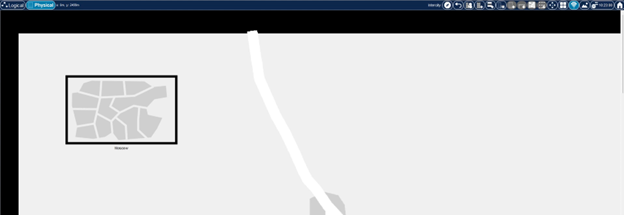
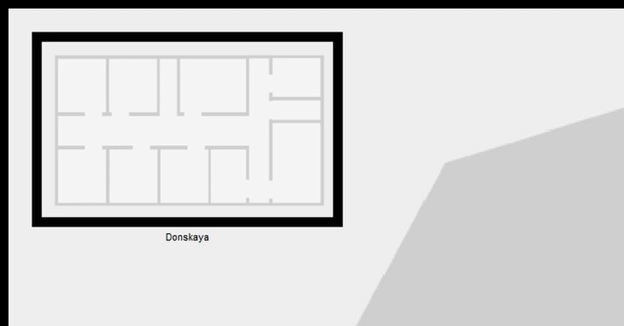
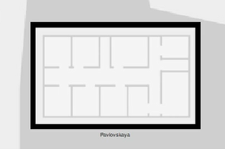
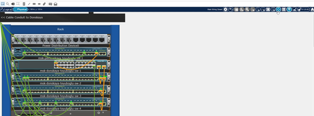
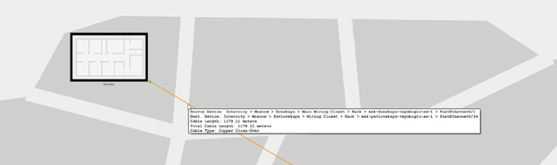
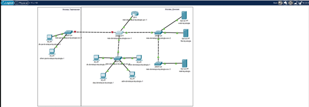
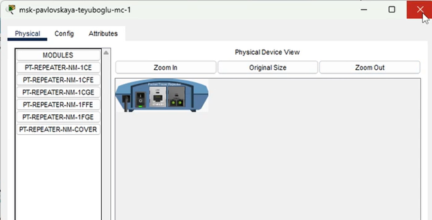
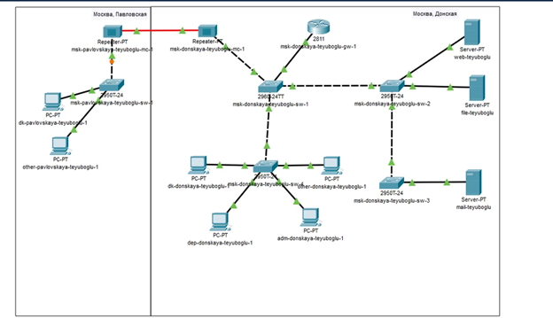

---
## Front matter
lang: ru-RU
title: Презентация по лабораторной работе №7
subtitle: ""
author:
  - Еюбоглу Тимур
institute:
  - Российский университет дружбы народов, Москва, Россия

## i18n babel
babel-lang: russian
babel-otherlangs: english

## Formatting pdf
toc: false
toc-title: Содержание
slide_level: 2
aspectratio: 169
section-titles: true
theme: metropolis
header-includes:
 - \metroset{progressbar=frametitle,sectionpage=progressbar,numbering=fraction}
---

## Докладчик

  * Еюбоглу Тимур
  * 1032224357
  * уч. группа: НПИбд-01-22
  * Факультет физико-математических и естественных наук
  * Российский университет дружбы народов

## Цель работы

Получить навыки работы с физической рабочей областью Packet Tracer, а также учесть физические параметры сети.

## Задания

Требуется заменить соединение между коммутаторами двух территорий msk-donskaya-sw-1 и msk-pavlovskaya-sw-1 (рис. 7.1) на соединение, учитывающее физические параметры сети, а именно — расстояние между двумя территориями. При выполнении работы необходимо учитывать соглашение об именовании (см. раздел 2.5).

# Выполнение лабораторной работы

## Физическая область

{#fig:001 width=70%}

## Физическая область

{#fig:002 width=70%}

## Физическая область

{#fig:003 width=70%}

## Физическая область

{#fig:004 width=70%}

## Физическая область

{#fig:005 width=70%}

## Логическая область

{#fig:006 width=70%}

## Репитер

{#fig:007 width=70%}

## Логическая область

{#fig:008 width=70%}

## Выводы

Были получены навыки работы с физической рабочей областью Packet Tracer, учитывая физические параметры сети.

