---
## Front matter
title: "Лабораторная работа 7"
subtitle: "Учет физических параметров сети"
author: "Еюбоглу Тимур"

## Generic otions
lang: ru-RU
toc-title: "Содержание"

## Bibliography
bibliography: bib/cite.bib
csl: pandoc/csl/gost-r-7-0-5-2008-numeric.csl

## Pdf output format
toc: true # Table of contents
toc-depth: 2
lof: true # List of figures
lot: true # List of tables
fontsize: 12pt
linestretch: 1.5
papersize: a4
documentclass: scrreprt
## I18n polyglossia
polyglossia-lang:
  name: russian
  options:
	- spelling=modern
	- babelshorthands=true
polyglossia-otherlangs:
  name: english
## I18n babel
babel-lang: russian
babel-otherlangs: english
## Fonts
mainfont: IBM Plex Serif
romanfont: IBM Plex Serif
sansfont: IBM Plex Sans
monofont: IBM Plex Mono
mathfont: STIX Two Math
mainfontoptions: Ligatures=Common,Ligatures=TeX,Scale=0.94
romanfontoptions: Ligatures=Common,Ligatures=TeX,Scale=0.94
sansfontoptions: Ligatures=Common,Ligatures=TeX,Scale=MatchLowercase,Scale=0.94
monofontoptions: Scale=MatchLowercase,Scale=0.94,FakeStretch=0.9
mathfontoptions:
## Biblatex
biblatex: true
biblio-style: "gost-numeric"
biblatexoptions:
  - parentracker=true
  - backend=biber
  - hyperref=auto
  - language=auto
  - autolang=other*
  - citestyle=gost-numeric
## Pandoc-crossref LaTeX customization
figureTitle: "Рис."
tableTitle: "Таблица"
listingTitle: "Листинг"
lofTitle: "Список иллюстраций"
lotTitle: "Список таблиц"
lolTitle: "Листинги"
## Misc options
indent: true
header-includes:
  - \usepackage{indentfirst}
  - \usepackage{float} # keep figures where there are in the text
  - \floatplacement{figure}{H} # keep figures where there are in the text
---

# Цель работы

Получить навыки работы с физической рабочей областью Packet Tracer, а также учесть физические параметры сети.

# Задание

Требуется заменить соединение между коммутаторами двух территорий msk-donskaya-sw-1 и msk-pavlovskaya-sw-1 (рис. 7.1) на соединение, учитывающее физические параметры сети, а именно — расстояние между двумя территориями. При выполнении работы необходимо учитывать соглашение об именовании (см. раздел 2.5).

# Выполнение лабораторной работы

1. Откроем проект предыдущей лабораторной работы.
2. Перейдем в физическую рабочую область Packet Tracer. Присвоим название городу — Moscow. (рис. [-@fig:001]).

{#fig:001 width=70%}

3. Щёлкнув на изображении города, мы увидим изображение здания (рис. 7.3). Присвоим ему название Donskaya. Добавим здание для территории  Pavlovskaya. (рис. [-@fig:002]) (рис. [-@fig:003]).

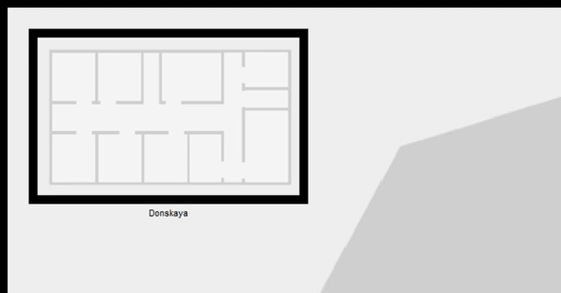{#fig:002 width=70%}

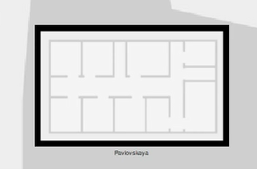{#fig:003 width=70%}

4. Щёлкнув на изображении здания Donskaya, переместим изображение, обозначающее серверное помещение, в него. (рис. [-@fig:004]).

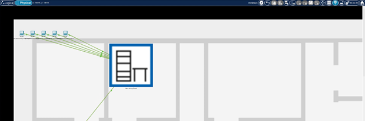{#fig:004 width=70%}

5. Щёлкнув на изображении серверной, мы увидим отображение серверных стоек. (рис. [-@fig:005]).

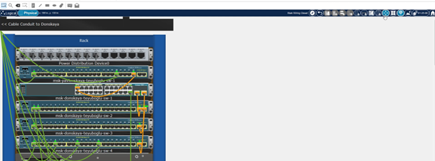{#fig:005 width=70%}

6. Переместим коммутатор msk-pavlovskaya-sw-1 и два оконечных устройства dk-pavlovskaya-1 и other-pavlovskaya-1 на территорию  Pavlovskaya, используя меню Move физической рабочей области Packet Tracer. (рис. [-@fig:006]).

{#fig:006 width=70%}

7. Вернувшись в логическую рабочую область Packet Tracer, пропингуем с коммутатора msk-donskaya-sw-1 коммутатор msk-pavlovskaya-sw-1. Убедимся в работоспособности соединения. (рис. [-@fig:007]).

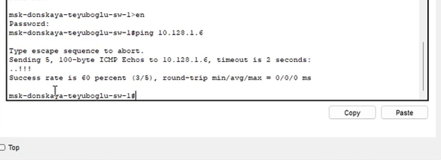{#fig:007 width=70%}

8. В меню Options , Preferences во вкладке Interface активируем разрешение на учёт физических характеристик среды передачи (Enable Cable  Length Effects). (рис. [-@fig:008]).

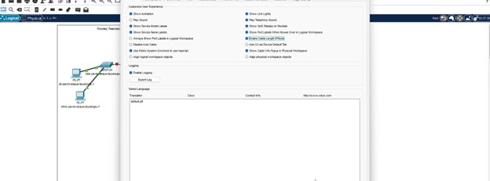{#fig:008 width=70%}

9. В физической рабочей области Packet Tracer разместите две территории на расстоянии более 100 м друг от друга (рекомендуемое расстояние - около 1000 м или более). (рис. [-@fig:009]) (рис. [-@fig:010]).

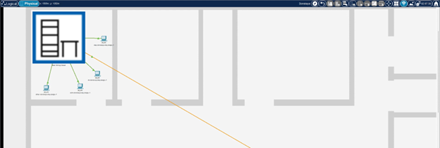{#fig:009 width=70%}

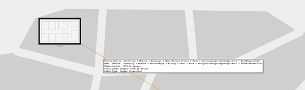{#fig:010 width=70%}

10. Вернувшись в логическую рабочую область Packet Tracer, пропингуем с коммутатора msk-donskaya-sw-1 коммутатор msk-pavlovskaya-sw-1.  Убедимся в неработоспособности соединения. (рис. [-@fig:011]).

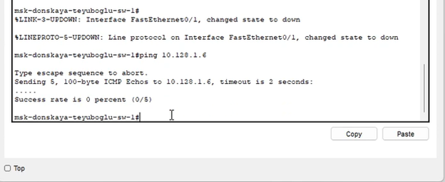{#fig:011 width=70%}

11. Удалим соединение между msk-donskaya-sw-1 и msk-pavlovskaya-sw-1. Добавим в логическую рабочую область два повторителя (RepeaterPT).  Присвоим им соответствующие названия msk-donskaya-mc-1 и msk-pavlovskaya-mc-1. Заменим имеющиеся модули на PT-REPEATERNM-1FFE и  PT-REPEATER-NM-1CFE для подключения оптоволокна и витой пары по технологии Fast Ethernet. (рис. [-@fig:012]).

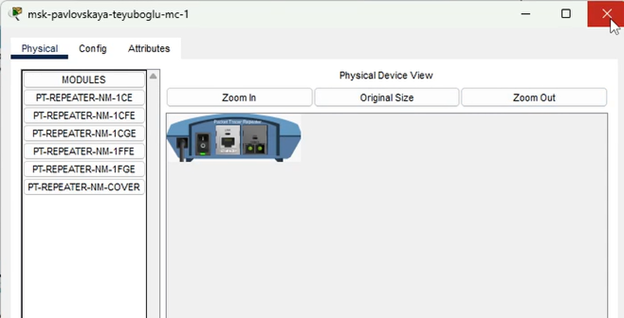{#fig:012 width=70%}

12. Переместим msk-pavlovskaya-mc-1 на территорию Pavlovskaya (в физической рабочей области Packet Tracer). (рис. [-@fig:013]).

{#fig:013 width=70%}

13. Подключите коммутатор msk-donskaya-sw-1 к msk-donskaya-mc-1 по витой паре, msk-donskaya-mc-1 и msk-pavlovskaya-mc-1 — по оптоволокну, msk-pavlovskaya-sw-1 к msk-pavlovskaya-mc-1 — по витой паре. (рис. [-@fig:014]).

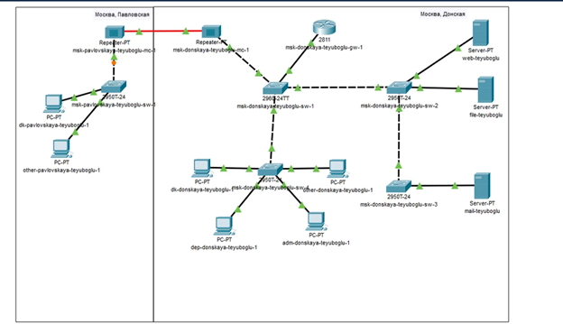{#fig:014 width=70%}

14. Убедимся в работоспособности соединения между msk-donskaya-sw-1 и msk-pavlovskaya-sw-1. (рис. [-@fig:015]).

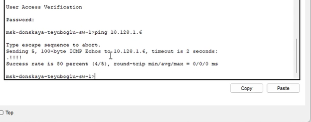{#fig:015 width=70%}

# Контрольные вопросы

1. Перечислите возможные среды передачи данных. На какие характеристики среды передачи данных следует обращать внимание при планировании 
сети?

Физическая среда передачи данных (medium) может представлять собой кабель, то есть набор проводов, изоляционных и защитных оболочек и соединительных разъемов, а также земную атмосферу или космическое пространство, через которые распространяются электромагнитные волны. В зависимости от среды передачи данных линии связи разделяются на следующие:
проводные (воздушные);
кабельные (медные и волоконно-оптические);
радиоканалы наземной и спутниковой связи.
Проводные (воздушные) линии связи представляют собой провода без каких-либо изолирующих или экранирующих оплеток, проложенные между
столбами и висящие в воздухе. По таким линиям связи традиционно передаются телефонные или телеграфные сигналы, но при отсутствии других возможностей эти линии используются и для передачи компьютерных данных. Скоростные качества и помехозащищенность этих линий оставляют желать много лучшего. Сегодня проводные линии связи быстро вытесняются кабельными. Кабельные линии представляют собой достаточно сложную конструкцию. Кабель состоит из проводников, заключенных в несколько слоев изоляции: электрической, электромагнитной, механической, а также, возможно, климатической. Кроме того, кабель может быть оснащен разъемами,  позволяющими быстро выполнять присоединение к нему различного оборудования. В компьютерных сетях применяются три основных типа кабеля:  кабели на основе скрученных пар медных проводов, коаксиальные кабели с медной жилой, а также волоконно-оптические кабели. Скрученная пара проводов называется витой парой (twisted pair). Витая пара существует в экранированном варианте (Shielded Twistedpair, STP), когда пара медных проводов обертывается в изоляционный экран, и неэкранированном (Unshielded Twistedpair, UTP), когда изоляционная обертка  отсутствует. Скручивание проводов снижает влияние внешних помех на полезные сигналы, передаваемые по кабелю. Коаксиальный кабель  (coaxial) имеет несимметричную конструкцию и состоит из внутренней медной жилы и оплетки, отделенной от жилы слоем изоляции. Существует  несколько типов коаксиального кабеля, отличающихся характеристиками и областями применения - для локальных сетей, для глобальных сетей,  для кабельного телевидения и т. п. Волоконно-оптический кабель (optical fiber) состоит из тонких (5-60 микрон) волокон, по которым  распространяются световые сигналы. Это наиболее качественный тип кабеля - он обеспечивает передачу данных с очень высокой скоростью (до  10 Гбит/с и выше) и к тому же лучше других типов передающей среды обеспечивает защиту данных от внешних помех. Радиоканалы наземной и  спутниковой связи образуются с помощью передатчика и приемника радиоволн. Существует большое количество различных типов радиоканалов,  отличающихся как используемым частотным диапазоном, так и дальностью канала. Диапазоны коротких, средних и длинных волн (KB, СВ и ДВ),  называемые также диапазонами амплитудной модуляции (Amplitude Modulation, AM) по типу используемого в них метода модуляции сигнала,  обеспечивают дальнюю связь, но при невысокой скорости передачи данных. Более скоростными являются каналы, работающие на диапазонах  ультракоротких волн (УКВ), для которых характерна частотная модуляция (Frequency Modulation, FM), а также диапазонах сверхвысоких частот  (СВЧ или microwaves). В диапазоне СВЧ (свыше 4 ГГц) сигналы уже не отражаются ионосферой Земли и для

2. Перечислите категории витой пары. Чем они отличаются? Какая категория в каких условиях может применяться? 

CAT1 (частотная полоса - 0,1 МГц). Имеет одну пару и используется для передачи голоса и цифровых данных при участии модема. Это стандартный телефонный кабель, который в свое время использовался в "скрученном" виде в США, а в России применяется и сейчас без скруток. Не подходит для современных систем и имеет большое влияние помех. 

CAT2 (частотная полоса - 1 МГц). Имеет две пары проводников и уже изжил себя. Иногда применяется при построении телефонных сетей. Ранее встречался в сетях Arcnet и Token Ring. Обладает скоростью передачи данных до 4 Мбит/с. Не годиться для построения современных сетей. 

CAT3 (частотная полоса - 16 МГц. Класс "С"). Встречается 2-х парный и 4-х парный тип витой пары. Применяется не только для создания телефонных, но и локальных сетей на базе 10BASE-T. Поддерживает скорость передачи данных от 10 до 100 Мбит/с по технологии 100BASE-T4 протяженностью не более 100 метров. В отличии от CAT1 и CAT2 поддерживает стандарт IEEE 802.3. 

CAT4 (частотная полоса - 20 МГц). В свое время этот 4-х парный кабель использовался в технологии 10BASE-T и 100BASE-T4. Возможна скорость передачи данных до 16 Мбит/с. В наши дни не используется. 

CAT5 (частотная полоса - 100 МГц. Класс "D"). Кабель применялся для создания телефонных линий и построения локальных сетей 100BASE-TX, а также в Ethernet (LAN). Поддерживает скорость передачи данных до 100 Мбит/с. 

CAT5e (частотная полоса 125 МГц). Это усовершенствованная витая пара пятой категории. При использовании 2-х пар поддерживает скорость передачи данных до 100 Мбит/с и до 1000 Мбит/с в 4-х парном кабеле. Как правило, используется 4-х парный кабель для построения локальной компьютерной сети. Это самый распространенный тип витой пары. 

CAT6 (частотная полоса 250 МГц. Класс "E"). Это распространенный тип кабеля, который применяется в сетях Fast Ethernet и Gigabit Ethernet. В структуре кабеля четыре пары проводников. Поддерживает высокую скорость передачи данных до до 10 Гбит/с протяженностью не более 55 метров. 

CAT6a (частотная полоса 500 МГц. Класс "EA"). Структура кабеля состоит из четырех пар проводников. Он используется в сетях Gigabit Ethernet и поддерживает скорость до 10 Гбит/с на расстоянии до 100 метров. 

CAT7 (частотная полоса 600 - 700 МГц. Класс "F"). Поддерживает скорость передачи данных до 10 Гбит/с. Структура кабеля имеет общий внешний экран и фольгированную защиту каждой пары. По типу относиться к S/FTP (ScreenedFullyShieldedTwistedPair).
 
CAT7a (частотная полоса 1000 -1200 МГц. Класс "FA"). Скорость витой пары доходит до 40 Гбит/с на расстоянии до 50 метров и до 100 Гбит/с протяженностью до 15 метров.

3.	В чем отличие одномодового и многомодового оптоволокна? Какой тип кабеля в каких условиях может применяться? 

У одномодового кабеля, диаметр сердечника составляет 10 мкм и меньше. В волокне с таким диаметром вероятность дисперсии значительно снижается, что позволяет передавать данные на большие расстояния. Одномодовое оптоволокно позволяет передавать данные со скоростью 10 Гб/с. Но в то же время одномодовый кабель и коммутирующее оборудование к нему дороже. Так же сварные стыки у одномода более чувствительны к качеству сварки.
Чаще всего многомодовое оптоволокно используется для организации ЛВС (локально-вычислительной сети) и СКС (структурированной кабельной сети) небольших размеров в рамках одного здания или прилегающих строений (около 500 метров). Волоконно-оптические линии связи с одномодовыми волокнами используют для подключения удаленных зданий, например для организации системы видеонаблюдения в рамках района, города или даже магистрали (1000м и более).

# Выводы

Были получены навыки работы с физической рабочей областью Packet Tracer, учитывая физические параметры сети.