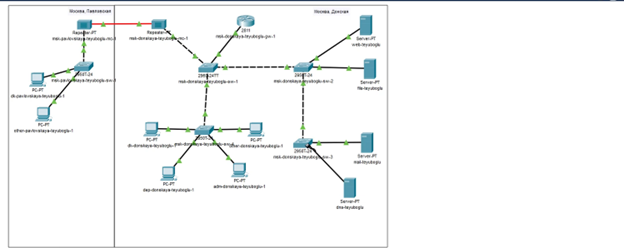
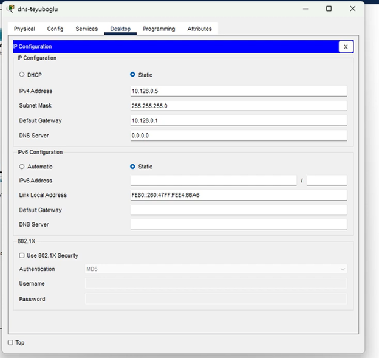
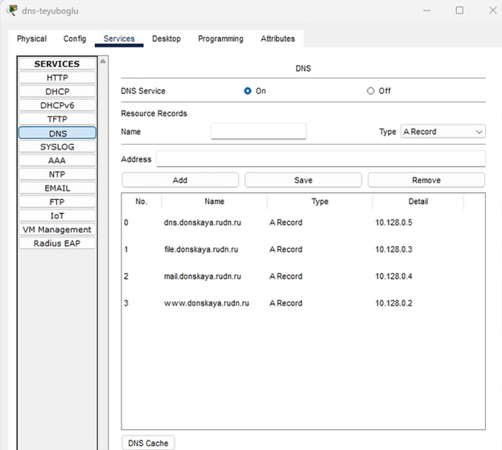
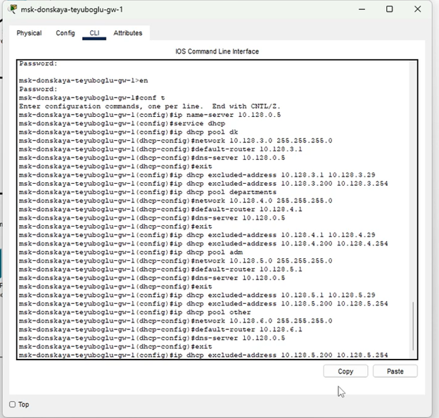
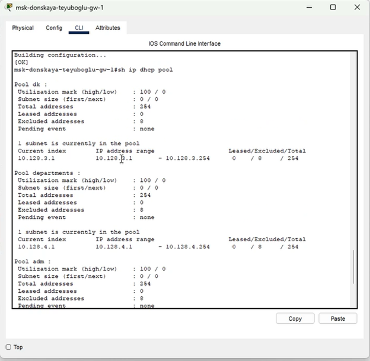
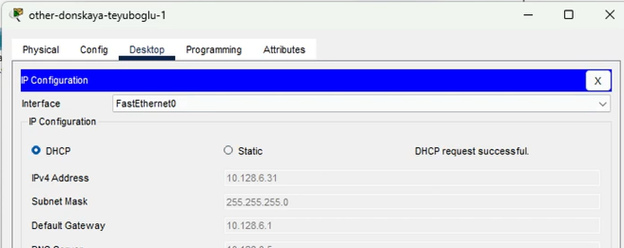
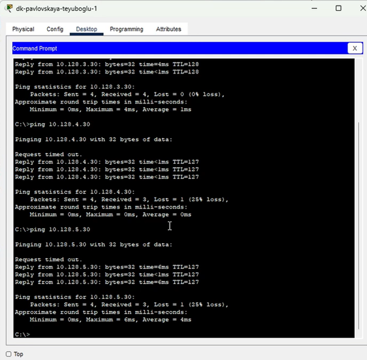
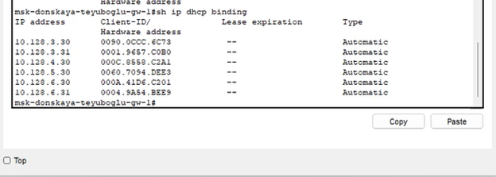
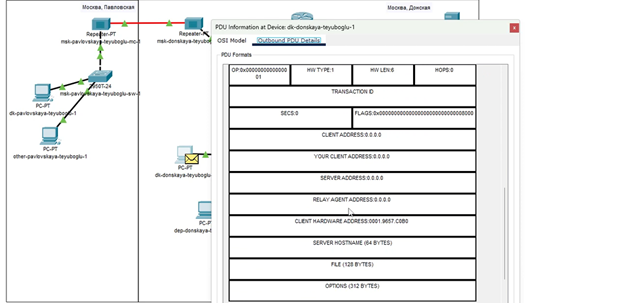
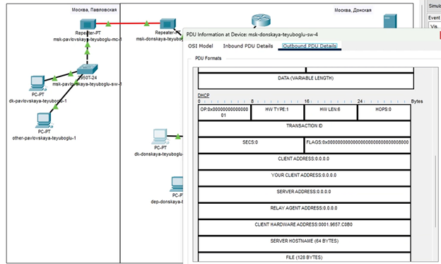

---
## Front matter
title: "Отчет по лабораторной работе №8 "
subtitle: "Администрирование локальных сетей"
author: "Еюбоглу Тимур, НПИбд-01-22"

## Generic otions
lang: ru-RU
toc-title: "Содержание"

## Bibliography
bibliography: bib/cite.bib
csl: pandoc/csl/gost-r-7-0-5-2008-numeric.csl

## Pdf output format
toc: true # Table of contents
toc-depth: 2
lof: true # List of figures
lot: false # List of tables
fontsize: 12pt
linestretch: 1.5
papersize: a4
documentclass: scrreprt
## I18n polyglossia
polyglossia-lang:
  name: russian
  options:
	- spelling=modern
	- babelshorthands=true
polyglossia-otherlangs:
  name: english
## I18n babel
babel-lang: russian
babel-otherlangs: english
## Fonts
mainfont: IBM Plex Serif
romanfont: IBM Plex Serif
sansfont: IBM Plex Sans
monofont: IBM Plex Mono
mathfont: STIX Two Math
mainfontoptions: Ligatures=Common,Ligatures=TeX,Scale=0.94
romanfontoptions: Ligatures=Common,Ligatures=TeX,Scale=0.94
sansfontoptions: Ligatures=Common,Ligatures=TeX,Scale=MatchLowercase,Scale=0.94
monofontoptions: Scale=MatchLowercase,Scale=0.94,FakeStretch=0.9
mathfontoptions:
## Biblatex
biblatex: true
biblio-style: "gost-numeric"
biblatexoptions:
  - parentracker=true
  - backend=biber
  - hyperref=auto
  - language=auto
  - autolang=other*
  - citestyle=gost-numeric
## Pandoc-crossref LaTeX customization
figureTitle: "Рис."
tableTitle: "Таблица"
listingTitle: "Листинг"
lofTitle: "Список иллюстраций"
lotTitle: "Список таблиц"
lolTitle: "Листинги"
## Misc options
indent: true
header-includes:
  - \usepackage{indentfirst}
  - \usepackage{float} # keep figures where there are in the text
  - \floatplacement{figure}{H} # keep figures where there are in the text
---

# Цель работы

Приобретение практических навыков по настройке динамического распределения IP-адресов посредством протокола DHCP (Dynamic Host Configuration Protocol) в локальной сети.

# Выполнение лабораторной работы

1.	В логическую рабочую область проекта добавьте сервер dns и подключите его к коммутатору msk-donskaya-teyuboglu-sw-3 через порт Fa0/2, не забыв активировать порт при помощи соответствующих команд на коммутаторе. В конфигурации сервера укажите в качестве адреса шлюза 10.128.0.1, а в качестве адреса самого сервера — 10.128.0.5 с соответствующей маской 255.255.255.0. (рис. [-@fig:001]) (рис. [-@fig:002]).

{#fig:001 width=70%}

{#fig:002 width=70%}

2. Настройте сервис DNS:  (рис. [-@fig:003]).

{#fig:003 width=70%}

3. Настройте DHCP-сервис на маршрутизаторе, используя приведённые ниже команды для каждой выделенной сети: укажите IP-адрес DNS-сервера, затем перейдите к настройке DHCP; задайте название конфигурируемому диапазону адресов (пулу адресов), укажите адрес сети, а также адреса шлюза и DNS-сервера; задайте пулы адресов, исключаемых из динамического распределения. (рис. [-@fig:004]) (рис. [-@fig:005]).

{#fig:004 width=70%}

{#fig:005 width=70%}

4. На оконечных устройствах замените в настройках статическое распределение адресов на динамическое. (рис. [-@fig:006]).

{#fig:006 width=70%}

5. Проверьте, какие адреса выделяются оконечным устройствам, а также доступность устройств из разных подсетей. (рис. [-@fig:007]) (рис. [-@fig:008]).

{#fig:007 width=70%}

{#fig:008 width=70%}

6. В режиме симуляции изучите, каким образом происходит запрос адреса по протоколу DHCP (какие сообщения и какие отклики передаются по сети). (рис. [-@fig:009]) (рис. [-@fig:010]).

{#fig:009 width=70%}

{#fig:010 width=70%}

# Конфигурация маршрутизатора

msk-donskaya-teyuboglu-gw-1#show running-config
Building configuration...

Current configuration : 2357 bytes
!
version 15.1
no service timestamps log datetime msec
no service timestamps debug datetime msec
service password-encryption
!
hostname msk-donskaya-teyuboglu-gw-1
!
!
!
enable secret 5 $1$mERr$hx5rVt7rPNoS4wqbXKX7m0
!
!
ip dhcp excluded-address 10.128.3.1 10.128.3.29
ip dhcp excluded-address 10.128.3.200 10.128.3.254
ip dhcp excluded-address 10.128.4.1 10.128.4.29
ip dhcp excluded-address 10.128.4.200 10.128.4.254
ip dhcp excluded-address 10.128.5.1 10.128.5.29
ip dhcp excluded-address 10.128.5.200 10.128.5.254
ip dhcp excluded-address 10.128.6.1 10.128.6.29
ip dhcp excluded-address 10.128.6.200 10.128.6.254
!
ip dhcp pool dk
network 10.128.3.0 255.255.255.0
default-router 10.128.3.1
dns-server 10.128.0.5
ip dhcp pool departments
network 10.128.4.0 255.255.255.0
default-router 10.128.4.1
dns-server 10.128.0.5
ip dhcp pool adm
network 10.128.5.0 255.255.255.0
default-router 10.128.5.1
dns-server 10.128.0.5
ip dhcp pool other
network 10.128.6.0 255.255.255.0
default-router 10.128.6.1
dns-server 10.128.0.5
!
!
!
ip cef
no ipv6 cef
!
!
!
username admin secret 5 $1$mERr$hx5rVt7rPNoS4wqbXKX7m0
!
!
license udi pid CISCO2811/K9 sn FTX1017P6GO-
!
!
!
!
!
!
!
!
!
ip ssh version 1
ip domain-name donskaya.rudn.edu
ip name-server 10.128.0.5
!
!
spanning-tree mode pvst
!
!
!
!
!
!
interface FastEthernet0/0
no ip address
duplex auto
speed auto
!
interface FastEthernet0/0.2
description managment
encapsulation dot1Q 2
ip address 10.128.1.1 255.255.255.0
!
interface FastEthernet0/0.3
description servers
encapsulation dot1Q 3
ip address 10.128.0.1 255.255.255.0
!
interface FastEthernet0/0.101
description dk
encapsulation dot1Q 101
ip address 10.128.3.1 255.255.255.0
!
interface FastEthernet0/0.102
description departaments
encapsulation dot1Q 102
ip address 10.128.4.1 255.255.255.0
!
interface FastEthernet0/0.103
description adm
encapsulation dot1Q 103
ip address 10.128.5.1 255.255.255.0
!
interface FastEthernet0/0.104
description other
encapsulation dot1Q 104
ip address 10.128.6.1 255.255.255.0
!
interface FastEthernet0/1
no ip address
duplex auto
speed auto
shutdown
!
interface Vlan1
no ip address
shutdown
!
ip classless
!
ip flow-export version 9
!
!
!
!
!
!
!
line con 0
password 7 0822455D0A16
login
!
line aux 0
!
line vty 0 4
password 7 0822455D0A16
login
transport input ssh
!
!
!
end

# Выводы

Изучили работу протокола DHCP и его настройку на маршрутизаторах Cisco.

# Ответы на впоросы

1.	За что отвечает протокол DHCP? 
DHCP (англ. Dynamic Host Configuration Protocol — протокол динамической настройки узла) — сетевой протокол, позволяющий компьютерам автоматически получать IP-адрес и другие параметры, необходимые для работы в сети TCP/IP.

2.	Какие типы DHCP-сообщений передаются по сети? 
1) DHCPDISCOVER — клиент шлет широковещательный пакет DHCPDISCOVER, пытаясь найти сервер DHCP в сети, в случаях, когда сервер DHCP не нашелся в той же подсети, что и  клиент, нужно настраивать на сетевых устройствах (маршрутизаторах) DHCP Relay Agent, в целях передачи пакета DHCPDISCOVER на сервер DHCP.
2) DHCPOFFER — сервер DHCP шлет широковещательный пакет DHCPOFFER для клиента, который включает предложение использовать уникальный IP адрес.
3) DHCPREQUEST — клиент шлет широковещательный пакет DHCPREQUEST на сервер DHCP с ответом, и «просит» у сервера выдать в аренду предложенный уникальный адрес.
4) DHCPACK — сервер DHCP шлет клиенту широковещательный пакет DHCPACK, в этот пакете сервером утверждается запрос клиента на использование IP-адреса, а также сообщаются и другие детали, такие, как сервера DNS, шлюз по умолчанию, и т.д. Если сервер не может предоставить запрашиваемый адрес или по каким-то причинам адрес недействителен, сервер посылает пакет  DHCPNACK.

3.	Какие параметры могут быть переданы в сообщениях DHCP? 

| Поле | Длина (байты) | Описание |
|:-----|:-------------:|---------:|
| op | 1 |	Тип сообщения |
| htype |	1 |	Тип адреса аппаратной части |
| hlen | 1 |Длина адреса аппаратной части |
| hops | 1 |Используемое количество агентов ретрансляции. Клиенты устанавливают значение на 0. |
| xid |	4 |	ID  (уникальный идентификационный номер) транзакции используемой клиентом и серверов во время сессии |
| secs | 2 |	Прошедшее время (в секундах) с момента запроса клиентом начала процесса |
| flags |	2 |Значение флагов |
| ciaddr | 4 |	IP-адрес клиента (если имелся ранее). |
| yiaddr | 4 | IP-адрес, предложенный сервером клиенту |
| siaddr | 4 |	IP-адрес сервера |
| giaddr | 4 |	IP-адрес relay-агента (агента ретрансляции) |
| chaddr | 16 |	Адрес аппаратной части клиента (в основном MAC). |
| sname |	64 |	Имя сервера. |
| file | 128 |	Название загрузочного файла. |
| options |	изменяемая |	Дополнительные опции |

4.	Что такое DNS? 
DNS (англ. Domain Name System — система доменных имён) — компьютерная распределённая система для получения информации о доменах. Чаще всего используется для получения IP-адреса по имени хоста (компьютера или устройства), получения информации о маршрутизации почты, обслуживающих узлах для протоколов в домене

5.	Какие типы записи описания ресурсов есть в DNS и для чего они используются?

•	Запись A (address record) или запись адреса связывает имя хоста с адресом протокола IPv4. Например, запрос A-записи на имя referrals.icann.org вернёт его IPv4-адрес — 192.0.34.164.

•	Запись AAAA (IPv6 address record) связывает имя хоста с адресом протокола IPv6. Например, запрос AAAA-записи на имя K.ROOT-SERVERS.NET вернёт его IPv6-адрес — 2001:7fd::1.

•	Запись CNAME (canonical name record) или каноническая запись имени (псевдоним) используется для перенаправления на другое имя.

•	Запись MX (mail exchange) или почтовый обменник указывает сервер(ы) обмена почтой для данного домена

•	Запись NS (name server) указывает на DNS-сервер для данного домена.

•	Запись PTR (pointer[5][6]) обратная DNS-запись или запись указателя связывает IP-адрес хоста с его каноническим именем. Запрос в домене in-addr.arpa на IP-адрес хоста в reverse-форме вернёт имя (FQDN) данного хоста (см. Обратный DNS-запрос). Например (на момент написания), для IP-адреса 192.0.34.164 запрос записи PTR 164.34.0.192.in-addr.arpa вернёт его каноническое имя referrals.icann.org. В целях уменьшения объёма нежелательной корреспонденции (спама) многие серверы-получатели электронной почты могут проверять наличие PTR-записи для хоста, с которого происходит отправка. В этом случае PTR-запись для IP-адреса должна соответствовать имени отправляющего почтового сервера, которым он представляется в процессе SMTP-сессии.

•	Запись SOA (Start of Authority) или начальная запись зоны указывает, на каком сервере хранится эталонная информация о данном домене, содержит контактную информацию лица, ответственного за данную зону, тайминги (параметры времени) кеширования зонной информации и взаимодействия DNS-серверов.

•	SRV-запись (server selection) указывает на серверы для сервисов, используется, в частности, для Jabber и Active Directory.
