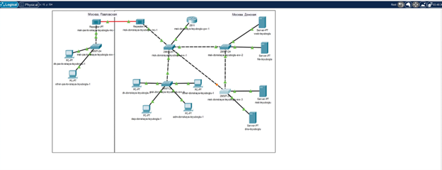
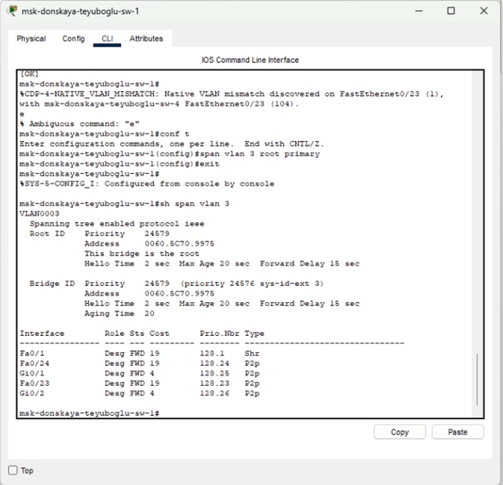
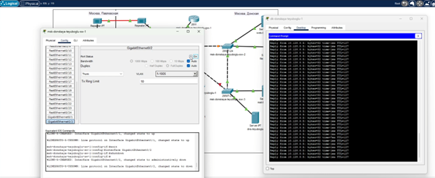
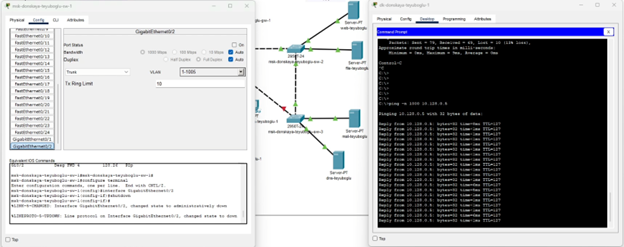
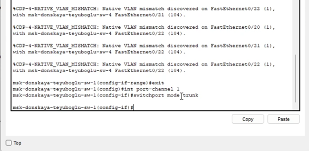

---
## Front matter
lang: ru-RU
title: Презентация по лабораторной работе №9
subtitle: ""
author:
  - Еюбоглу Тимур
institute:
  - Российский университет дружбы народов, Москва, Россия

## i18n babel
babel-lang: russian
babel-otherlangs: english

## Formatting pdf
toc: false
toc-title: Содержание
slide_level: 2
aspectratio: 169
section-titles: true
theme: metropolis
header-includes:
 - \metroset{progressbar=frametitle,sectionpage=progressbar,numbering=fraction}
---

## Докладчик

  * Еюбоглу Тимур
  * 1032224357
  * уч. группа: НПИбд-01-22
  * Факультет физико-математических и естественных наук
  * Российский университет дружбы народов

## Цели и задачи

Изучение возможностей протокола STP и его модификаций по обеспечению отказоустойчивости сети, агрегированию интерфейсов и перераспределению нагрузки между ними.

# Выполнение лабораторной работы

## Резервное соединение
{#fig:001 width=70%}

## Протокол STP

{#fig:002 width=70%}

## Тест отказоустойчивости

{#fig:003 width=70%}

## Тест отказоустойчивости

{#fig:004 width=70%}

## Port-Channel

{#fig:005 width=70%}

# Выводы по проделанной работе

## Выводы

Изучили работу протокола STP и агрегирование подключения.

