---
## Front matter
title: "Отчет по лабораторной работе №9 "
subtitle: "Администрирование локальных сетей"
author: "Еюбоглу Тимур, НПИбд-01-22"

## Generic otions
lang: ru-RU
toc-title: "Содержание"

## Bibliography
bibliography: bib/cite.bib
csl: pandoc/csl/gost-r-7-0-5-2008-numeric.csl

## Pdf output format
toc: true # Table of contents
toc-depth: 2
lof: true # List of figures
lot: false # List of tables
fontsize: 12pt
linestretch: 1.5
papersize: a4
documentclass: scrreprt
## I18n polyglossia
polyglossia-lang:
  name: russian
  options:
	- spelling=modern
	- babelshorthands=true
polyglossia-otherlangs:
  name: english
## I18n babel
babel-lang: russian
babel-otherlangs: english
## Fonts
mainfont: IBM Plex Serif
romanfont: IBM Plex Serif
sansfont: IBM Plex Sans
monofont: IBM Plex Mono
mathfont: STIX Two Math
mainfontoptions: Ligatures=Common,Ligatures=TeX,Scale=0.94
romanfontoptions: Ligatures=Common,Ligatures=TeX,Scale=0.94
sansfontoptions: Ligatures=Common,Ligatures=TeX,Scale=MatchLowercase,Scale=0.94
monofontoptions: Scale=MatchLowercase,Scale=0.94,FakeStretch=0.9
mathfontoptions:
## Biblatex
biblatex: true
biblio-style: "gost-numeric"
biblatexoptions:
  - parentracker=true
  - backend=biber
  - hyperref=auto
  - language=auto
  - autolang=other*
  - citestyle=gost-numeric
## Pandoc-crossref LaTeX customization
figureTitle: "Рис."
tableTitle: "Таблица"
listingTitle: "Листинг"
lofTitle: "Список иллюстраций"
lotTitle: "Список таблиц"
lolTitle: "Листинги"
## Misc options
indent: true
header-includes:
  - \usepackage{indentfirst}
  - \usepackage{float} # keep figures where there are in the text
  - \floatplacement{figure}{H} # keep figures where there are in the text
---

# Цель работы

Изучение возможностей протокола STP и его модификаций по обеспечению отказоустойчивости сети, агрегированию интерфейсов и перераспределению нагрузки между ними.

# Задание

1. Сформируйте резервное соединение между коммутаторами msk-donskayasw-1 и msk-donskaya-sw-3.
2. Настройте балансировку нагрузки между резервными соединениями.
3. Настройте режим Portfast на тех интерфейсах коммутаторов, к которым подключены серверы.
4. Изучите отказоустойчивость резервного соединения.
5. Сформируйте и настройте агрегированное соединение интерфейсов Fa0/20 – Fa0/23 между коммутаторами msk-donskaya-sw-1 и msk-donskaya-sw-4.
6. При выполнении работы необходимо учитывать соглашение об именовании (см. раздел 2.5).

# Выполнение лабораторной работы

1. Сформируйте резервное соединение между коммутаторами msk-donskayasw-1 и msk-donskaya-sw-3 (рис. 9.1). Для этого:
  – замените соединение между коммутаторами msk-donskaya-sw-1 (Gig0/2) и msk-donskaya-sw-4 (Gig0/1) на соединение между коммутаторами msk-donskaya-sw-1 (Gig0/2) и msk-donskaya-sw-3 (Gig0/2);
  – сделайте порт на интерфейсе Gig0/2 коммутатора msk-donskaya-sw-3 транковым:
  – соединение между коммутаторами msk-donskaya-sw-1 и mskdonskaya-sw-4 сделайте через интерфейсы Fa0/23, не забыв активировать их в транковом режиме. (рис. [-@fig:001]).

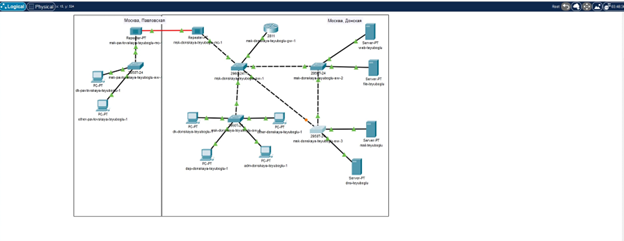{#fig:001 width=80%}

2. С оконечного устройства dk-donskaya-1 пропингуйте серверы mail и web.
В режиме симуляции проследите движение пакетов ICMP. Убедитесь, что движение пакетов происходит через коммутатор msk-donskaya-sw-2. (рис. [-@fig:002]).

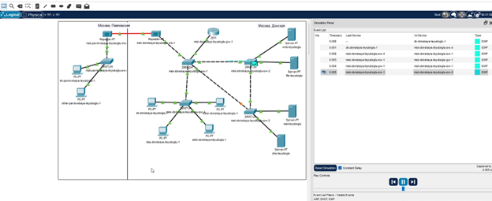{#fig:002 width=80%}

3. На коммутаторе msk-donskaya-sw-2 посмотрите состояние протокола STP для vlan 3: (рис. [-@fig:003]).

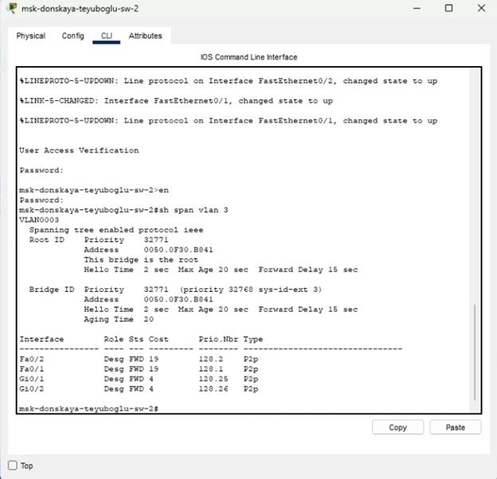{#fig:003 width=80%}

4. В качестве корневого коммутатора STP настройте коммутатор msk-donskaya-sw-1. (рис. [-@fig:004]).

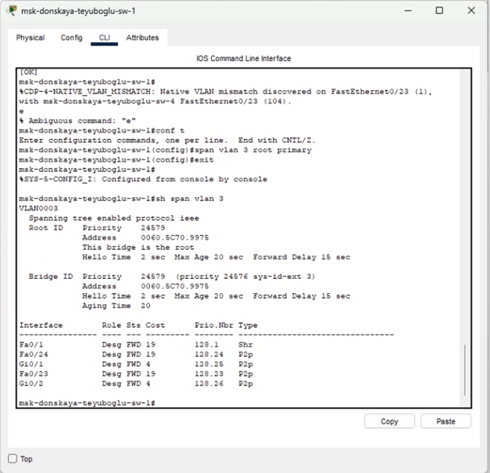{#fig:004 width=80%}

5. Используя режим симуляции, убедитесь, что пакеты ICMP пойдут от хоста dk-donskaya-1 до mail через коммутаторы msk-donskaya-sw-1 и msk-donskaya- sw-3, а от хоста dk-donskaya-1 до web через коммутаторы msk-donskaya-sw-1 и msk-donskaya-sw-2. (рис. [-@fig:005]).

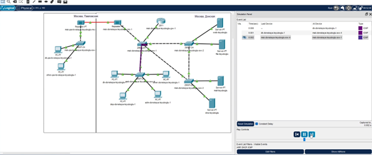{#fig:005 width=80%}

6. Настройте режим Portfast на тех интерфейсах коммутаторов, к которым подключены серверы: (рис. [-@fig:006]).

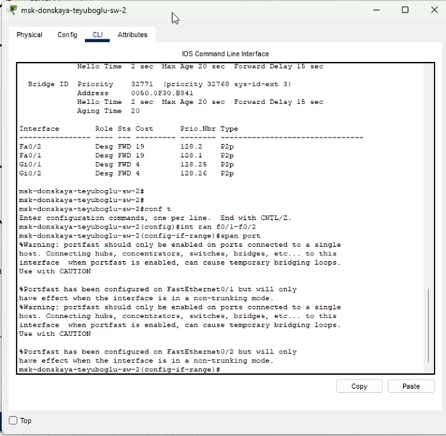{#fig:006 width=80%}

7. Изучите отказоустойчивость протокола STP и время восстановления соединения при переключении на резервное соединение. Для этого используйте команду ping -n 1000 mail.donskaya.rudn.ru на хосте dkdonskaya- 1, а разрыв соединения обеспечьте переводом соответствующего интерфейса коммутатора в состояние shutdown. (рис. [-@fig:007]).

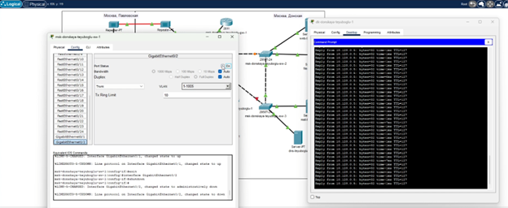{#fig:007 width=80%}

8. Переключите коммутаторы режим работы по протоколу Rapid PVST+: (рис. [-@fig:008]).

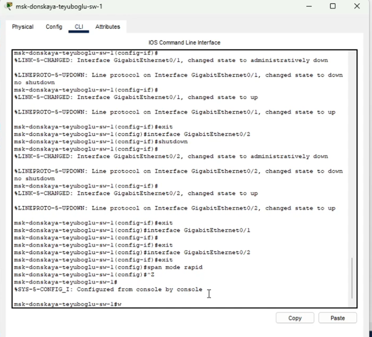{#fig:008 width=80%}

9. Изучите отказоустойчивость протокола Rapid PVST+ и время восстановления соединения при переключении на резервное соединение. (рис. [-@fig:009]).

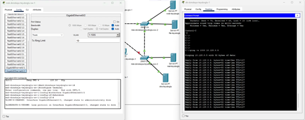{#fig:009 width=80%}

10. Сформируйте агрегированное соединение интерфейсов Fa0/20 – Fa0/23 между коммутаторами msk-donskaya-sw-1 и msk-donskaya-sw-4
11. Настройте агрегирование каналов (режим EtherChannel): (рис. [-@fig:010]) (рис. [-@fig:011]).

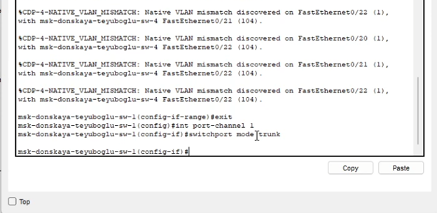{#fig:010 width=80%}

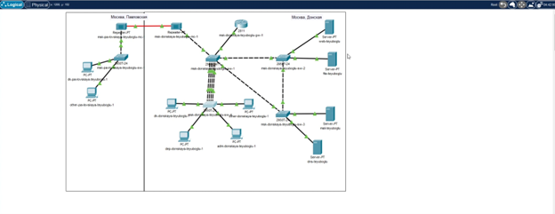{#fig:011 width=80%}

# Контрольные вопросы

1. Какую информацию можно получить, воспользовавшись командой определения состояния протокола STP для VLAN (на корневом и не на корневом устройстве)? Приведите примеры вывода подобной информации на устройствах –  
VLAN… // Номер VLAN
STP … // Тип протокола
Root ID/Bridge ID // Ближайший коммутатор/Текущий
коммутатор
Priority … // Приоритет
Address … // MAC-адрес
Cost … // «Затраты» до этого коммутатора
Port … // Порт
Hello Time … Max Age … Forward Delay … Aging Time … // Время
работы STP // Свойства портов
2. При помощи какой команды можно узнать, в каком режиме, STP или Rapid PVST+, работает устройство? Приведите примеры вывода подобной информации на устройствах - 
sh ru
3. Для чего и в каких случаях нужно настраивать режим Portfast? 
- Он позволяет сразу включать выделенные порты, поскольку они не подключены к коммутаторам и не участвуют во включении STP.
4. В чем состоит принцип работы агрегированного интерфейса? Для чего он используется? 
- Он объединяет параллельные каналы для увеличения пропускной способности, а также не теряет соединение при обрыве одного из каналов, перенаправляя трафик.
5. В чём принципиальные отличия при использовании протоколов LACP (Link Aggregation Control Protocol), PAgP (Port Aggregation Protocol) и статического агрегирования без использования протоколов? 
- LACP общий стандарт IEEE, PAgP — локальный протокол Cisco. Для них обязательна настройка сторон (активная, пассивная, авто). При статическом агрегировании коммутатор обрабатывает данные как с магистрали, даже если она не настроена на другой стороне.
6. При помощи каких команд можно узнать состояние агрегированного канала EtherChannel? 
- show etherchannel

# Выводы

Изучили работу протокола STP и агрегирование подключения.