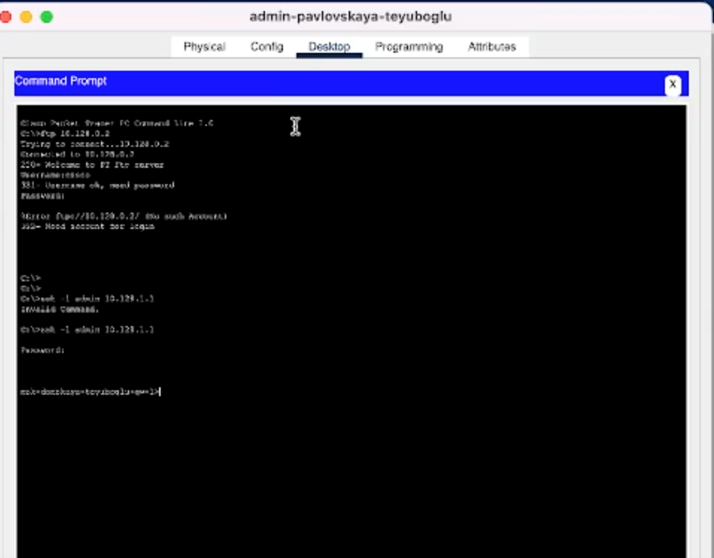

---
## Front matter
lang: ru-RU
title: Презентация по лабораторной работе №10
subtitle: "Администрирование локальных сетей"
author:
  - Еюбоглу Тимур
institute:
  - Российский университет дружбы народов, Москва, Россия

## i18n babel
babel-lang: russian
babel-otherlangs: english

## Formatting pdf
toc: false
toc-title: Содержание
slide_level: 2
aspectratio: 169
section-titles: true
theme: metropolis
header-includes:
 - \metroset{progressbar=frametitle,sectionpage=progressbar,numbering=fraction}
---

## Докладчик

  * Еюбоглу Тимур
  * 1032224357
  * уч. группа: НПИбд-01-22
  * Факультет физико-математических и естественных наук
  * Российский университет дружбы народов

## Цели и задачи

Освоить настройку прав доступа пользователей к ресурсам сети

# Выполнение лабораторной работы

## Списки доступа

Servers-out

• Разрешает доступ на веб-сервер по протоколу http для всех, telnet и ftp только для администраторов.

• Разрешает доступ на файловый сервер по протоколу SMB для локальной сети и по FTP для всех

• Разрешает доступ на почтовый сервер по протоколам SMTP и POP3

• Разрешает прохождение dns-запросов

• Разрешает пинг-запросы

## Списки доступа

Other-in
• Разрешает доступ администраторам ко всем устройствам сети.

• Остальные действия запрещает Management-out

• Разрешает доступ к управлению устройствами cisco только для администраторов.

## Списки доступа

{#fig:001 width=80%}

## Проверка конфигурации

{#fig:002 width=80%}

## Проверка конфигурации

{#fig:003 width=80%}

## Проверка конфигурации

{#fig:004 width=80%}

## Проверка конфигурации

{#fig:005 width=80%}

## Проверка конфигурации

{#fig:006 width=80%}

# Выводы по проделанной работе

## Выводы

Благодаря выполнению данной лабораторной работы, мы освоили настройку прав доступа пользователей к ресурсам сети 
