---
## Front matter
title: "Лабораторная работа №10"
subtitle: "Настройка списков управления доступом ACL"
author: "Еюбоглу Тимур"

## Generic otions
lang: ru-RU
toc-title: "Содержание"

## Bibliography
bibliography: bib/cite.bib
csl: pandoc/csl/gost-r-7-0-5-2008-numeric.csl

## Pdf output format
toc: true # Table of contents
toc-depth: 2
lof: true # List of figures
lot: true # List of tables
fontsize: 12pt
linestretch: 1.5
papersize: a4
documentclass: scrreprt
## I18n polyglossia
polyglossia-lang:
  name: russian
  options:
  - spelling=modern
  - babelshorthands=true
polyglossia-otherlangs:
  name: english
## I18n babel
babel-lang: russian
babel-otherlangs: english
## Fonts
mainfont: IBM Plex Serif
romanfont: IBM Plex Serif
sansfont: IBM Plex Sans
monofont: IBM Plex Mono
mathfont: STIX Two Math
mainfontoptions: Ligatures=Common,Ligatures=TeX,Scale=0.94
romanfontoptions: Ligatures=Common,Ligatures=TeX,Scale=0.94
sansfontoptions: Ligatures=Common,Ligatures=TeX,Scale=MatchLowercase,Scale=0.94
monofontoptions: Scale=MatchLowercase,Scale=0.94,FakeStretch=0.9
mathfontoptions:
## Biblatex
biblatex: true
biblio-style: "gost-numeric"
biblatexoptions:
  - parentracker=true
  - backend=biber
  - hyperref=auto
  - language=auto
  - autolang=other*
  - citestyle=gost-numeric
## Pandoc-crossref LaTeX customization
figureTitle: "Рис."
tableTitle: "Таблица"
listingTitle: "Листинг"
lofTitle: "Список иллюстраций"
lotTitle: "Список таблиц"
lolTitle: "Листинги"
## Misc options
indent: true
header-includes:
  - \usepackage{indentfirst}
  - \usepackage{float} # keep figures where there are in the text
  - \floatplacement{figure}{H} # keep figures where there are in the text
---

# Цель работы

Освоить настройку прав доступа пользователей к ресурсам сети

# Задачи

1) web-сервер: разрешить доступ всем пользователям по протоколу HTTP через порт 80 протокола TCP, а для администратора открыть доступ по протоколам Telnet и FTP;
2) файловый сервер: с внутренних адресов сети доступ открыт по портам для общедоступных каталогов, с внешних — доступ по протоколу FTP;
3) почтовый сервер: разрешить пользователям работать по протоколам SMTP и POP3 (соответственно через порты 25 и 110 протокола TCP), а для администратора — открыть доступ по протоколам Telnet и FTP;
4) DNS-сервер: открыть порт 53 протокола UDP для доступа из внутренней сети;
5) разрешить icmp-сообщения, направленные в сеть серверов;
6) запретить для сети Other любые запросы за пределы сети, за исключением администратора;
7) разрешить доступ в сеть управления сетевым оборудованием только администратору сети

# Выполнение лабораторной работы

1. На главном (и единственном) роутере создаем списки доступа:
Servers-out
разрешает доступ на веб-сервер по протоколу http для всех, telnet и ftp
только для администраторов.
Разрешает доступ на файловый сервер по протоколу SMB для
локальной сети и по FTP для всех
Разрешает доступ на почтовый сервер по протоколам SMTP и POP3
Разрешает прохождение dns-запросов
Разрешает пинг-запросы
Other-in
Разрешает доступ администраторам ко всем устройствам сети.
Остальные действия запрещает
Management-out
Разрешает доступ к управлению устройствами cisco только для
администраторов. (рис. [-@fig:001]) (рис. [-@fig:002]).

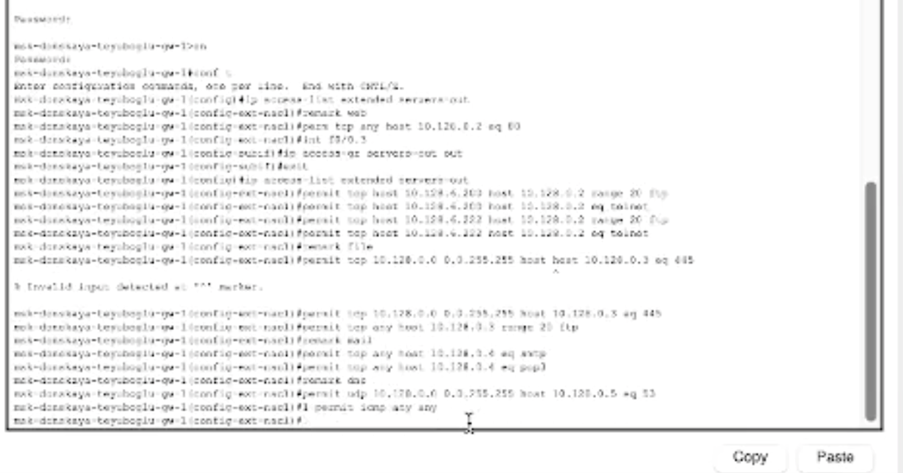{#fig:001 width=80%}

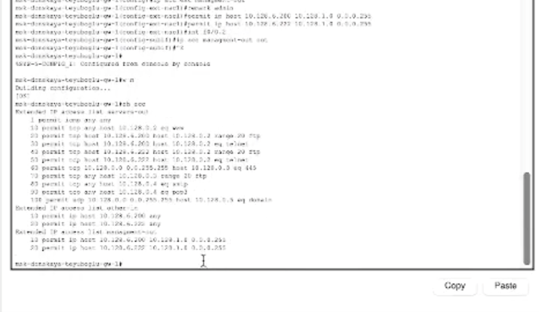{#fig:002 width=80%}

2. Проверяем работу списков доступа. Компьютеры могут получить доступ к сайту организации (рис. [-@fig:003]) (рис. [-@fig:004]).

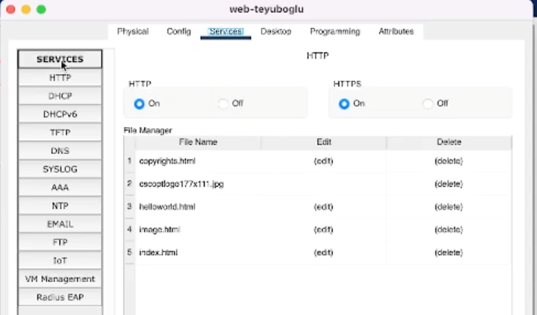{#fig:003 width=80%}

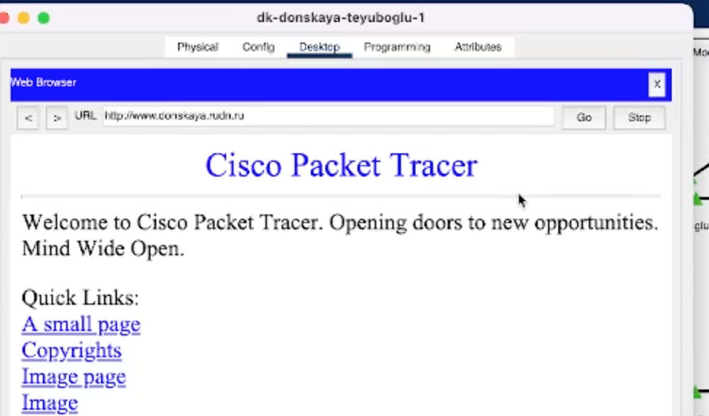{#fig:004 width=80%}

3. При этом по FTP подключиться к web-серверу не получилось (рис. [-@fig:005]).

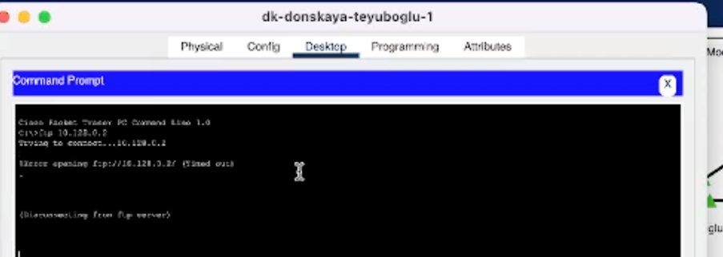{#fig:005 width=80%}

4. Устанавливаем компьютер администратора (рис. [-@fig:006]).

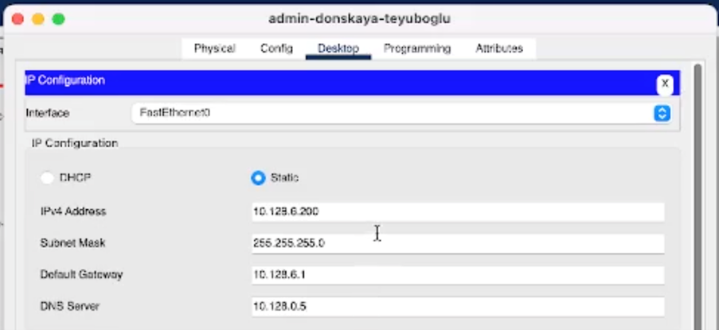{#fig:006 width=80%}

5. У администратора FTP работает (рис. [-@fig:007]).

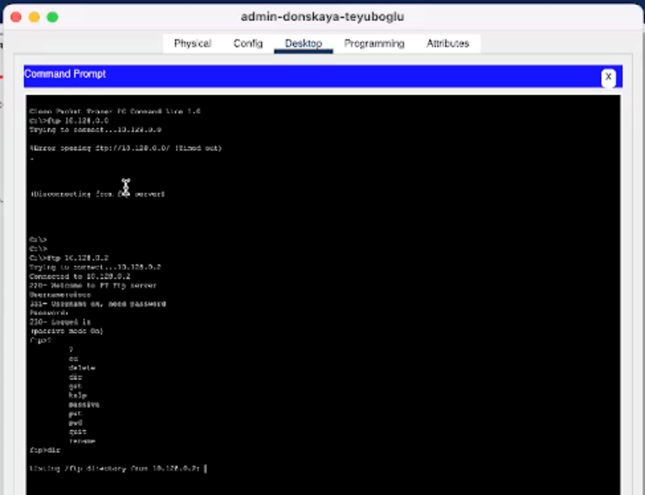{#fig:007 width=80%}

6. На файловый сервер по FTP могут подключаться и остальные пользователи (рис. [-@fig:008]).

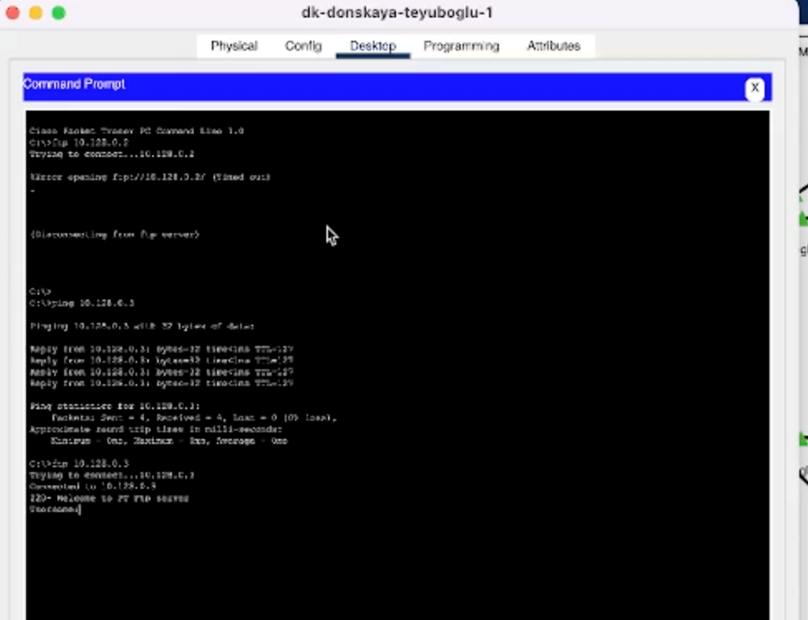{#fig:008 width=80%}

7. Пользователям из группы other(vlan 104) запрещены любые действия(рис. [-@fig:009]).

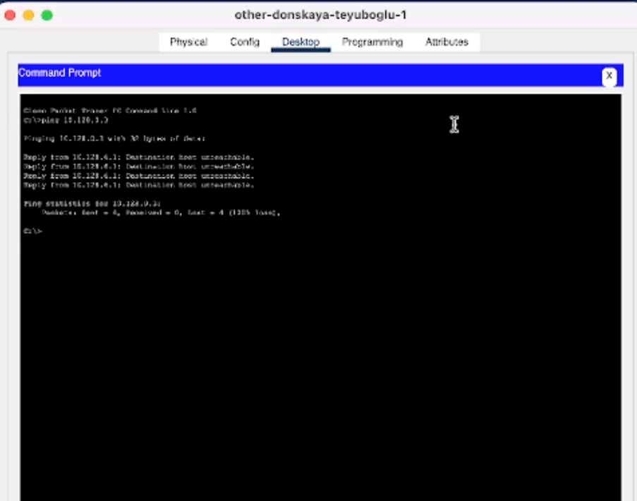{#fig:009 width=80%}

8. Настроим почтовый сервер (рис. [-@fig:010]).

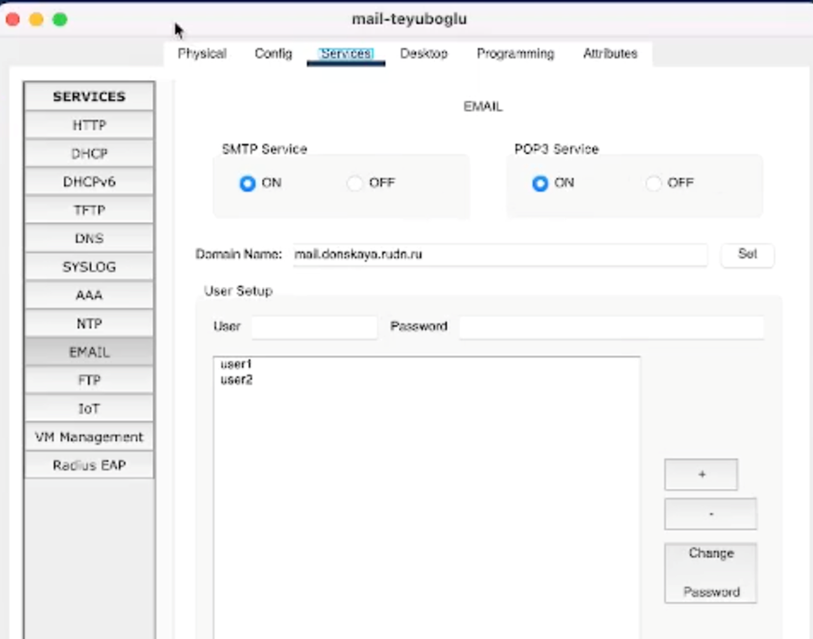{#fig:010 width=80%}

9. Обмен письмами (рис. [-@fig:011]).

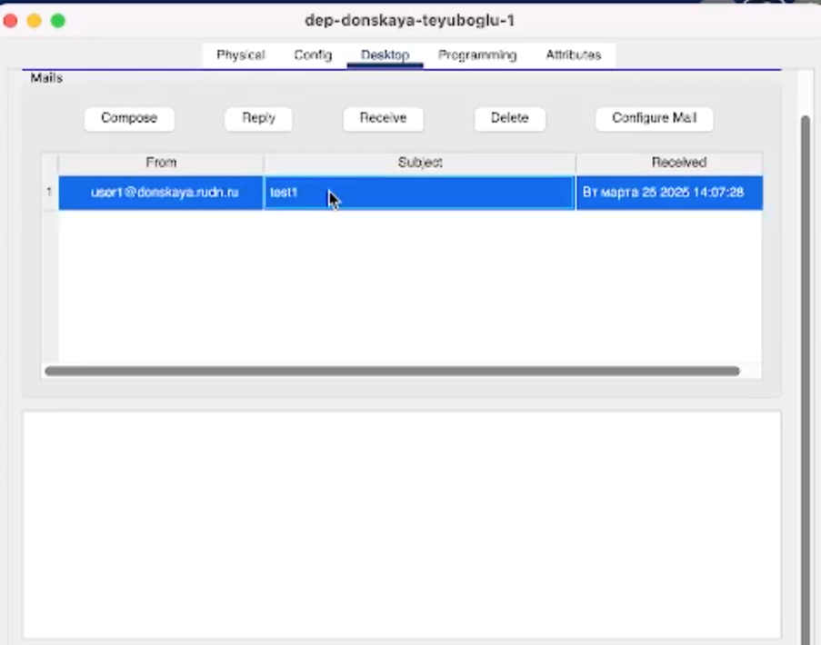{#fig:011 width=80%}

10. Добавляем второго администратора (рис. [-@fig:012]).

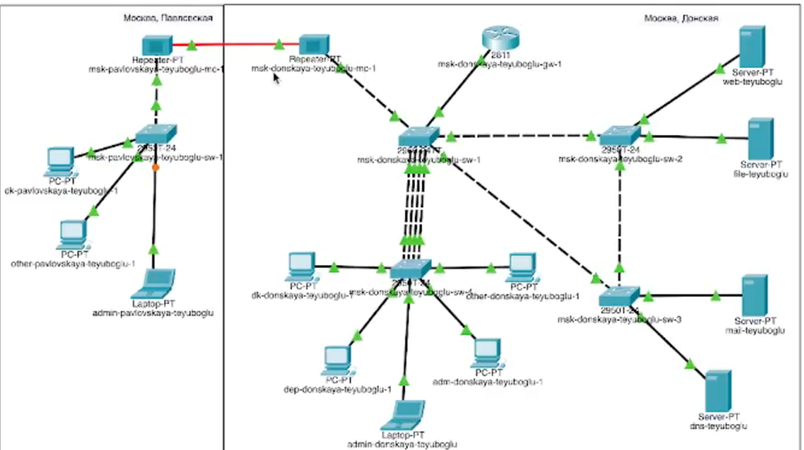{#fig:012 width=80%}

11. Он работает по FTP и SSH (рис. [-@fig:013]).

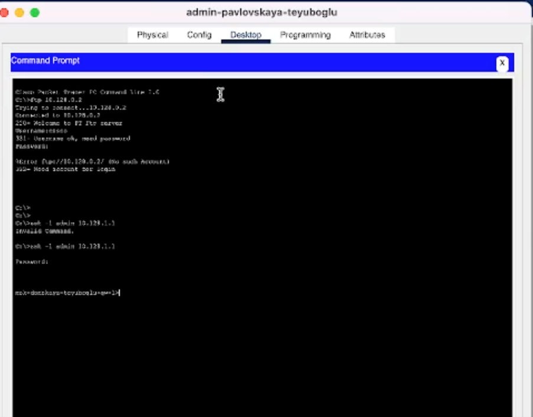{#fig:013 width=80%}

11. Пользователи могут работать по SSH только с роутером (рис. [-@fig:014]).

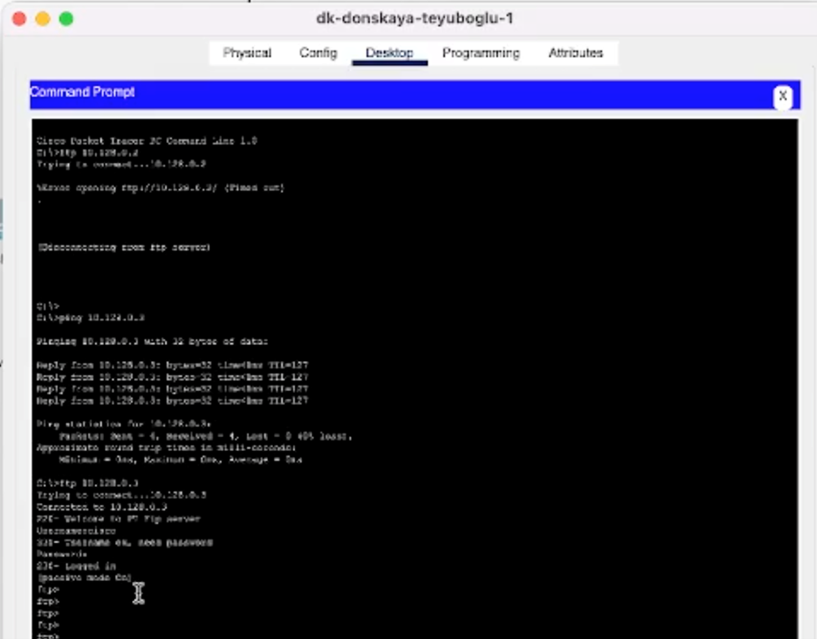{#fig:014 width=80%}

# Контрольные вопросы

1 Как задать действие правила для конкретного протокола?
#permit tcp host 10.128.6.200 host 10.128.0.2 eq telnet после указания хостов пишется атрибут eq и после него протокол
2 Как задать действие правила сразу для нескольких портов? 
#permit tcp any host 10.128.0.3 range 20 21 после указания хостов пишется атрибут range и диапазон портов
3 Как узнать номер правила в списке прав доступа?
командой show access-list
4 Каким образом можно изменить порядок применения правил в списке контроля доступа?
поставить цифру, указывающую на номер будущего правила, перед его формулировкой. Либо нужно экспортировать файл конфигурации и отредактировать его на другом устройстве, после чего импортировать обратно.

# Выводы

Благодаря выполнению данной лабораторной работы, мы освоили настройку прав доступа пользователей к ресурсам сети 