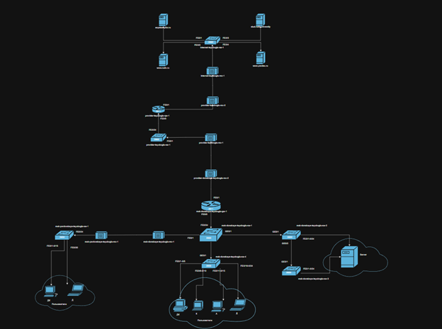
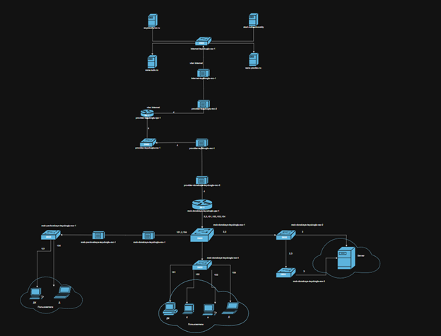
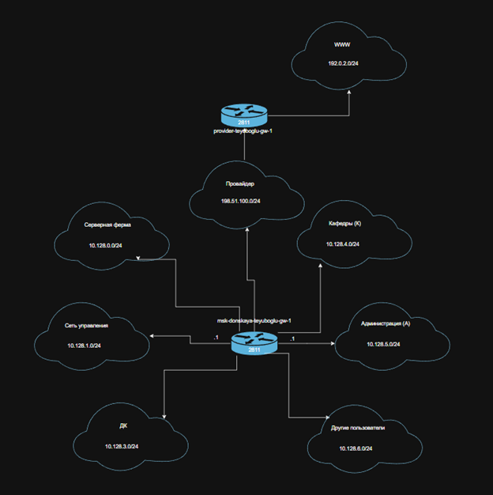
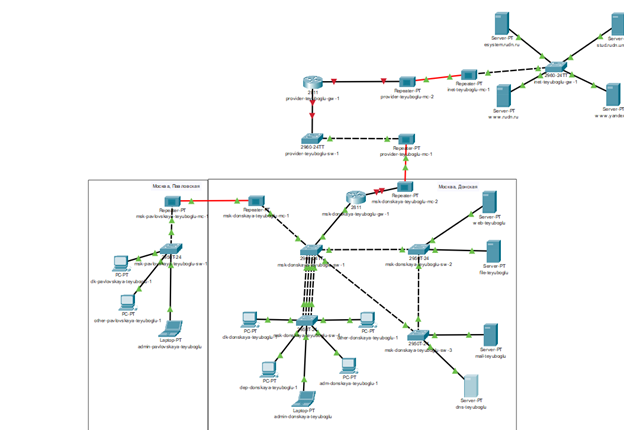
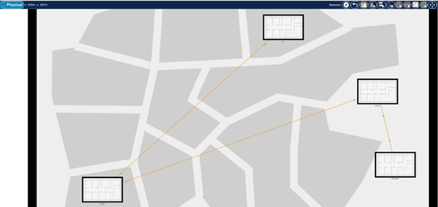
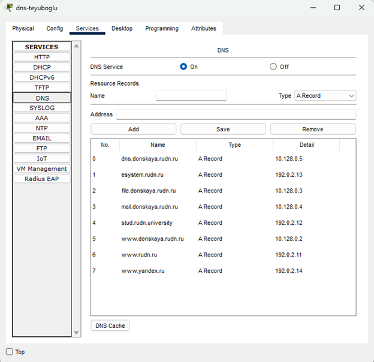

---
## Front matter
lang: ru-RU
title: Презентация по лабораторной работе №11
subtitle: "Администрирование локальных сетей"
author:
  - Еюбоглу Тимур
institute:
  - Российский университет дружбы народов, Москва, Россия

## i18n babel
babel-lang: russian
babel-otherlangs: english

## Formatting pdf
toc: false
toc-title: Содержание
slide_level: 2
aspectratio: 169
section-titles: true
theme: metropolis
header-includes:
 - \metroset{progressbar=frametitle,sectionpage=progressbar,numbering=fraction}
---

## Докладчик

  * Еюбоглу Тимур
  * 1032224357
  * уч. группа: НПИбд-01-22
  * Факультет физико-математических и естественных наук
  * Российский университет дружбы народов

# Цели и задачи работы

## Цели и задания лабораторной работы

Провести подготовительные мероприятия по подключению локальной сети организации к Интернету.
1. Построить схему подсоединения локальной сети к Интернету.
2. Построить модельные сети провайдера и сети Интернет (рис. 11.2).
3. Построить схемы сетей L1, L2, L3.
4. При выполнении работы необходимо учитывать соглашение об именовании(см. раздел 2.5).

# Выполнение лабораторной работы

## Схема сети

{#fig:001 width=80%}

## Схема сети

{#fig:002 width=80%}

## Схема сети

{#fig:003 width=80%}

## Модель сети

{#fig:004 width=80%}

## Модель сети

{#fig:005 width=80%}

## Конфигурация DNS

{#fig:006 width=80%}

# Выводы по проделанной работе

## Выводы

Провели подготовительные мероприятия для подключения к глобальной сети
