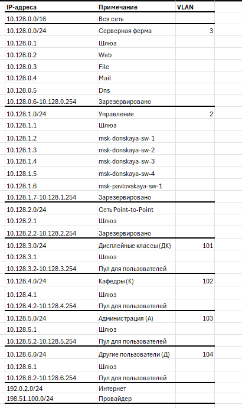

---
## Front matter
title: "Отчет по лабораторной работе №11 "
subtitle: "Администрирование локальных сетей"
author: "Еюбоглу Тимур, НПИбд-01-22"

## Generic otions
lang: ru-RU
toc-title: "Содержание"

## Bibliography
bibliography: bib/cite.bib
csl: pandoc/csl/gost-r-7-0-5-2008-numeric.csl

## Pdf output format
toc: true # Table of contents
toc-depth: 2
lof: true # List of figures
lot: false # List of tables
fontsize: 12pt
linestretch: 1.5
papersize: a4
documentclass: scrreprt
## I18n polyglossia
polyglossia-lang:
  name: russian
  options:
	- spelling=modern
	- babelshorthands=true
polyglossia-otherlangs:
  name: english
## I18n babel
babel-lang: russian
babel-otherlangs: english
## Fonts
mainfont: IBM Plex Serif
romanfont: IBM Plex Serif
sansfont: IBM Plex Sans
monofont: IBM Plex Mono
mathfont: STIX Two Math
mainfontoptions: Ligatures=Common,Ligatures=TeX,Scale=0.94
romanfontoptions: Ligatures=Common,Ligatures=TeX,Scale=0.94
sansfontoptions: Ligatures=Common,Ligatures=TeX,Scale=MatchLowercase,Scale=0.94
monofontoptions: Scale=MatchLowercase,Scale=0.94,FakeStretch=0.9
mathfontoptions:
## Biblatex
biblatex: true
biblio-style: "gost-numeric"
biblatexoptions:
  - parentracker=true
  - backend=biber
  - hyperref=auto
  - language=auto
  - autolang=other*
  - citestyle=gost-numeric
## Pandoc-crossref LaTeX customization
figureTitle: "Рис."
tableTitle: "Таблица"
listingTitle: "Листинг"
lofTitle: "Список иллюстраций"
lotTitle: "Список таблиц"
lolTitle: "Листинги"
## Misc options
indent: true
header-includes:
  - \usepackage{indentfirst}
  - \usepackage{float} # keep figures where there are in the text
  - \floatplacement{figure}{H} # keep figures where there are in the text
---

# Цель работы

Провести подготовительные мероприятия по подключению локальной сети организации к Интернету.

# Задачи

1. Построить схему подсоединения локальной сети к Интернету.
2. Построить модельные сети провайдера и сети Интернет (рис. 11.2).
3. Построить схемы сетей L1, L2, L3.
4. При выполнении работы необходимо учитывать соглашение об именовании(см. раздел 2.5).

# Выполнение лабораторной работы

1. Схема подключения L1 (рис. [-@fig:001]).

{#fig:001 width=80%}

2. Схема Vlan сети L2 (рис. [-@fig:002]).

{#fig:002 width=80%}

3. Схема маршрутизации сети L3 (рис. [-@fig:003]).

{#fig:003 width=80%}

Задание 1. Планирование сети с адресом 10.128.0.0/16 (рис. [-@fig:004]) (рис. [-@fig:005]) (рис. [-@fig:006]).

{#fig:004 width=80%}

{#fig:005 width=80%}

{#fig:006 width=80%}

Построим сеть (рис. [-@fig:007]).

{#fig:007 width=80%}

Физическое размещение (рис. [-@fig:008]).

{#fig:008 width=80%}

Настройка DNS (рис. [-@fig:009]).

{#fig:009 width=80%}

# Контрольные вопросы

1 Что такое Network Address Translation (NAT)?
это механизм в сетях TCP/IP, позволяющий преобразовывать IP-адреса транзитных пакетов

2 Как определить, находится ли узел сети за NAT?
С компьютера обратиться к сайту определения IP-адреса, например яндекс.интернометр, SPEEDTEST, 2ip. Если адрес, показанный сервисом, отличается от адреса интерфейса компьютера, то используется NAT.

3 Какое оборудование отвечает за преобразование адреса методом NAT?
Маршрутизатор

4 В чём отличие статического, динамического и перегруженного NAT?
Статический NAT — Отображение незарегистрированного IP-адреса на зарегистрированный IP-адрес на основании один к одному. Особенно полезно, когда устройство должно быть доступным снаружи сети. 
Динамический NAT — Отображает незарегистрированный IP-адрес на зарегистрированный адрес из группы зарегистрированных IP-адресов. Динамический NAT также устанавливает непосредственное отображение между незарегистрированными и зарегистрированными адресами, но отображение может меняться в зависимости от зарегистрированного адреса, доступного в пуле адресов, во время коммуникации.
Перегруженный NAT (NAPT, NAT Overload, PAT, маскарадинг) — форма динамического NAT, который отображает несколько незарегистрированных адресов в единственный зарегистрированный IP-адрес, используя различные порты. Известен также как PAT (Port Address Translation). При перегрузке каждый компьютер в частной сети транслируется в тот же самый адрес, но с различным номером порта.

5 Охарактеризуйте типы NAT.
Симметричный NAT (Symmetric NAT) — трансляция, при которой каждое соединение, инициируемое парой «внутренний адрес: внутренний порт» преобразуется в свободную уникальную случайно выбранную пару «публичный адрес: публичный порт». При этом инициация соединения из публичной сети невозможна. Cone NAT, Full Cone NAT — Однозначная (взаимная) трансляция между парами «внутренний адрес: внутренний порт» и «публичный адрес: публичный порт». Любой внешний хост может инициировать соединение с внутренним хостом (если это разрешено в правилах межсетевого экрана).
Address-Restricted cone NAT, Restricted cone NAT — Постоянная трансляция между парой «внутренний адрес: внутренний порт» и «публичный адрес: публичный порт». Любое соединение, инициированное с внутреннего адреса, позволяет в дальнейшем получать ему пакеты с любого порта того публичного хоста, к которому он отправлял пакет(ы) ранее.
Port-Restricted cone NAT — Трансляция между парой «внутренний адрес: внутренний порт» и «публичный адрес: публичный порт», при которой входящие пакеты проходят на внутренний хост только с одного порта публичного хоста — того, на который внутренний хост уже посылал пакет.

# Выводы

Благодаря выполнению данной лабораторной работы, мы провели подготовительные мероприятия по подключению локальной сети организации к Интернету.
