---
## Front matter
title: "Отчет по лабораторной работе №12"
subtitle: "Администрирование локальных сетей"
author: "Еюбоглу Тимур, НПИбд-01-22"

## Generic otions
lang: ru-RU
toc-title: "Содержание"

## Bibliography
bibliography: bib/cite.bib
csl: pandoc/csl/gost-r-7-0-5-2008-numeric.csl

## Pdf output format
toc: true # Table of contents
toc-depth: 2
lof: true # List of figures
lot: false # List of tables
fontsize: 12pt
linestretch: 1.5
papersize: a4
documentclass: scrreprt
## I18n polyglossia
polyglossia-lang:
  name: russian
  options:
	- spelling=modern
	- babelshorthands=true
polyglossia-otherlangs:
  name: english
## I18n babel
babel-lang: russian
babel-otherlangs: english
## Fonts
mainfont: IBM Plex Serif
romanfont: IBM Plex Serif
sansfont: IBM Plex Sans
monofont: IBM Plex Mono
mathfont: STIX Two Math
mainfontoptions: Ligatures=Common,Ligatures=TeX,Scale=0.94
romanfontoptions: Ligatures=Common,Ligatures=TeX,Scale=0.94
sansfontoptions: Ligatures=Common,Ligatures=TeX,Scale=MatchLowercase,Scale=0.94
monofontoptions: Scale=MatchLowercase,Scale=0.94,FakeStretch=0.9
mathfontoptions:
## Biblatex
biblatex: true
biblio-style: "gost-numeric"
biblatexoptions:
  - parentracker=true
  - backend=biber
  - hyperref=auto
  - language=auto
  - autolang=other*
  - citestyle=gost-numeric
## Pandoc-crossref LaTeX customization
figureTitle: "Рис."
tableTitle: "Таблица"
listingTitle: "Листинг"
lofTitle: "Список иллюстраций"
lotTitle: "Список таблиц"
lolTitle: "Листинги"
## Misc options
indent: true
header-includes:
  - \usepackage{indentfirst}
  - \usepackage{float} # keep figures where there are in the text
  - \floatplacement{figure}{H} # keep figures where there are in the text
---

# Цель работы

Приобретение практических навыков по настройке доступа локальной сети к внешней сети посредством NAT.

# Задание

Приобретение практических навыков по настройке доступа локальной сети к внешней сети посредством NAT.
1) сеть управления устройствами не должна иметь доступ в Интернет;
2) оконечные устройства сети дисплейных классов должны иметь доступ только к сайтам, необходимым для учёбы (в данном случае к www.yandex. ru, stud.rudn.university);
3) пользователям из сети кафедр разрешено работать только с образовательными сайтами (в данном случае это esystem.pfur.ru);
4) пользователям сети администрации разрешено работать только с сайтом университета www.rudn.ru;
5) в сети для других пользователей компьютер администратора должен иметь полный доступ во внешнюю сеть, а другие пользователи — не должны выходить в Интернет;
6) ограничения для серверов: – WEB-сервер должен быть доступен по порту 80; – почтовый сервер должен быть доступен по портам 25 и 110; – файловый сервер должен быть доступен извне по портам протокола FTP;
7) компьютер администратора должен быть доступен из внешней сети по протоколу удалённого рабочего стола (Remote Desktop Protocol, RDP).

# Выполнение лабораторной работы

Настраиваем коммутатор провайдера. Все порты переводятся в транковый режим.
Добавляем 4 vlan для подключения университета. (рис. [-@fig:001]).

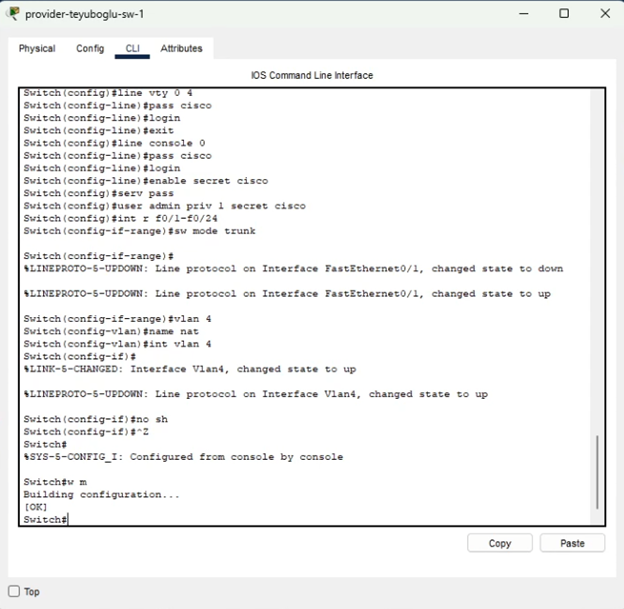{#fig:001 width=70%}

Настраиваем маршрутизатор провайдера. Присваиваем адреса интерфейсам для клиентов и для интернета. (рис. [-@fig:002]).

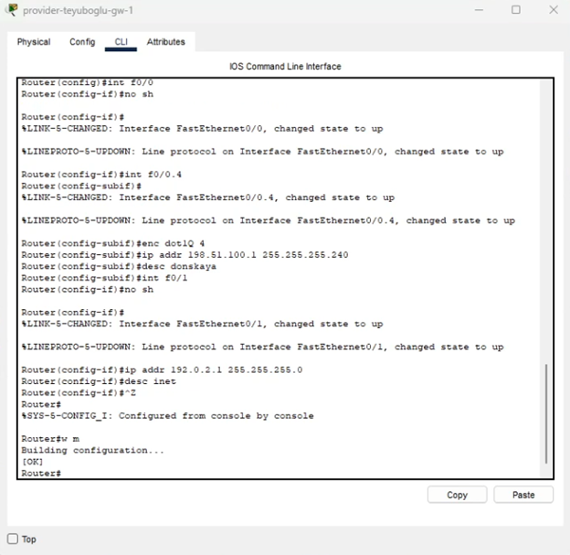{#fig:002 width=70%}

Сервера сайтов были настроены в предыдущей работе, Коммутатор интернета в настройке не нуждается

Переходим к настройке маршрутизатора университета. В соответствии с заданием создаем списки доступа. Задаем трансляцию внутренних адресов, принадлежащих серверам, во внешние. (рис. [-@fig:003]) (рис. [-@fig:004]).

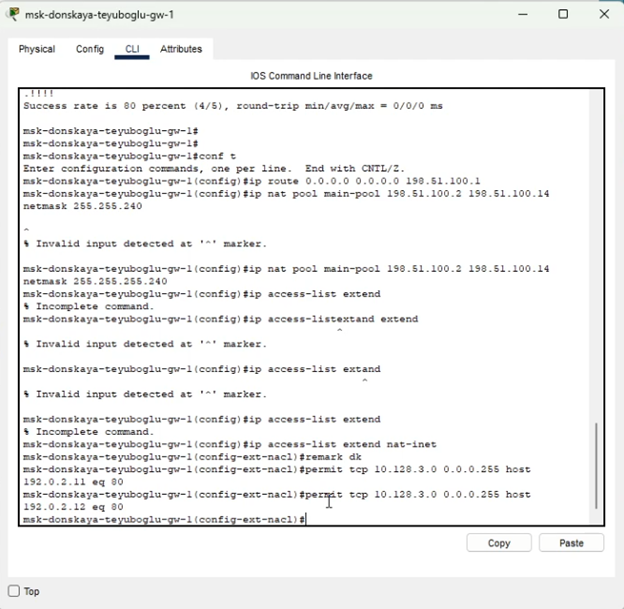{#fig:003 width=70%}

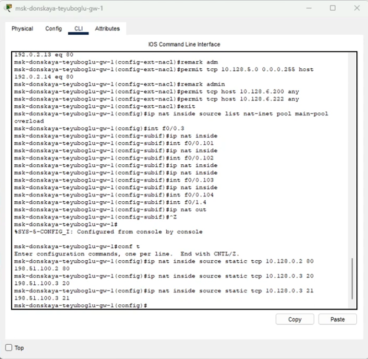{#fig:004 width=70%}

Проверим как наши пользователи могут выходить в интернет.

Администратору позволено все. (рис. [-@fig:005]).

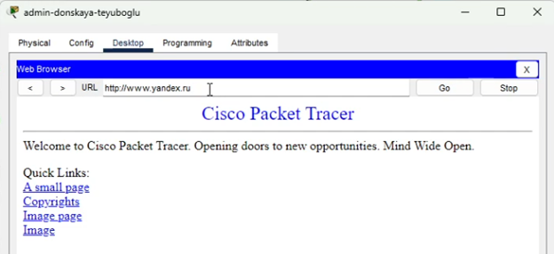{#fig:005 width=70%}

Пользователи – только на сайт вуза и яндекс. (рис. [-@fig:006]) (рис. [-@fig:007]) (рис. [-@fig:008]).

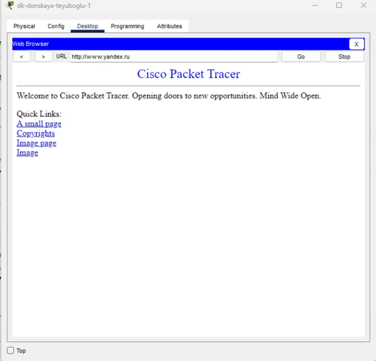{#fig:006 width=70%}

{#fig:007 width=70%}

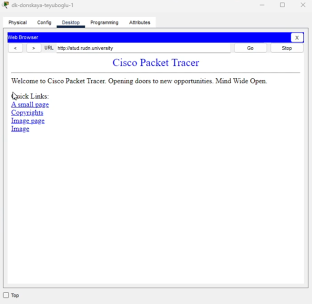{#fig:008 width=70%}

В интернет нас пускает. Теперь проверим пускает ли из интернета к нам. Установим за НАТом, в интернете пользователя и попробуем с него зайти на веб-сервер по http. (рис. [-@fig:009]) (рис. [-@fig:010]).

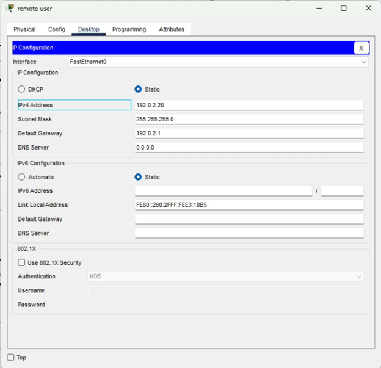{#fig:009 width=70%}

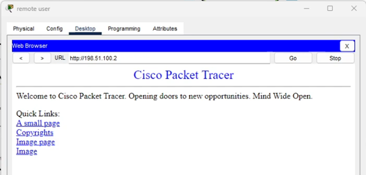{#fig:010 width=70%}

Вход выполнен. (рис. [-@fig:011]) (рис. [-@fig:012]).

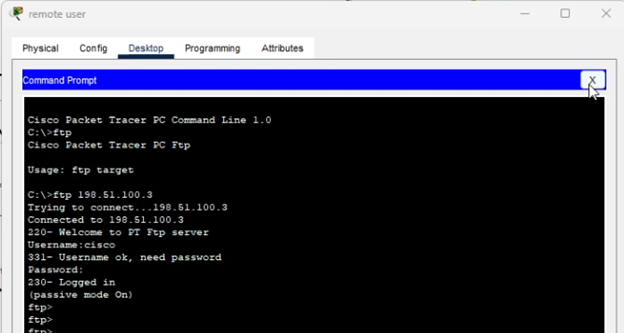{#fig:011 width=70%}

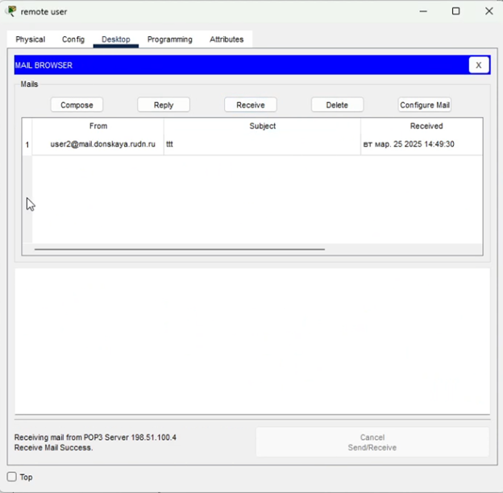{#fig:012 width=70%}

# Выводы

Настроили доступ к всемирной сети и правила NAT

# Контрольные вопросы

1. В чём состоит основной принцип работы NAT (что даёт наличие NAT в сети организации)? - NAT на устройстве позволяет ему соединять публичные и частные сети между собой с помощью только одного IP-адреса для группы.

2. В чём состоит принцип настройки NAT (на каком оборудовании и что нужно настроить для из локальной сети во внешнюю сеть через NAT)? - Настроить интерфейсы на внутренних маршрутизаторах, наборы правил для преобразования IP.

3. Можно ли применить Cisco IOS NAT к субинтерфейсам? - Да, поскольку они существуют в энергонезависимой памяти.

4. Что такое пулы IP NAT? - Выделяемые для трансляции NAT IP.

5. Что такое статические преобразования NAT? - Взаимно однозначное преобразование внутренних IP во внешние.