---
## Front matter
lang: ru-RU
title: Презентация по лабораторной работе №13
subtitle: ""
author:
  - Еюбоглу Тимур
institute:
  - Российский университет дружбы народов, Москва, Россия

## i18n babel
babel-lang: russian
babel-otherlangs: english

## Formatting pdf
toc: false
toc-title: Содержание
slide_level: 2
aspectratio: 169
section-titles: true
theme: metropolis
header-includes:
 - \metroset{progressbar=frametitle,sectionpage=progressbar,numbering=fraction}
 - '\makeatletter'
 - '\makeatother'
---

## Докладчик

  * Еюбоглу Тимур
  * 1032224357
  * уч. группа: НПИбд-01-22
  * Факультет физико-математических и естественных наук
  * Российский университет дружбы народов

# Цель и задачи

## Цель и задания лабораторной работы

Провести подготовительные мероприятия по организации взаимодействия через сеть провайдера посредством статической маршрутизации локальной сети с сетью основного здания, расположенного в 42-м квартале в Москве, и сетью филиала, расположенного в г. Сочи.

## Задачи

1. Внести изменения в схемы L1, L2 и L3 сети, добавив в них информацию о сети основной территории (42-й квартал в Москве) и сети филиала в г. Сочи.
2. Дополнить схему проекта, добавив подсеть основной территории организации 42-го квартала в Москве и подсеть филиала в г. Сочи (раздел 13.4.1).
3. Сделать первоначальную настройку добавленного в проект оборудования (разделы 13.4.2 и 13.4.3).
4. При выполнении работы необходимо учитывать соглашение об именовании (см. раздел 2.5).

# Процесс выполнения лабораторной работы

## Внесение изменений в схему L1

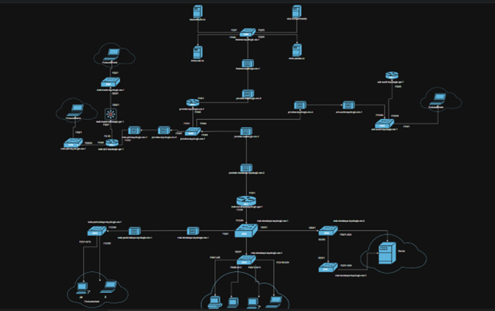{#fig:001 width=70%}

## Таблица VLAN (г.Сочи)

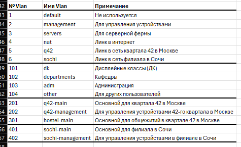{#fig:002 width=70%}

## Таблица IP (разные территории)

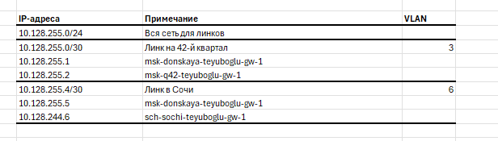{#fig:003 width=70%}

## Таблица IP (42-й квартал г.Москва)

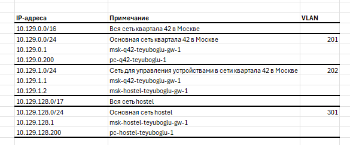{#fig:004 width=70%}

## Таблица IP (г.Сочи)

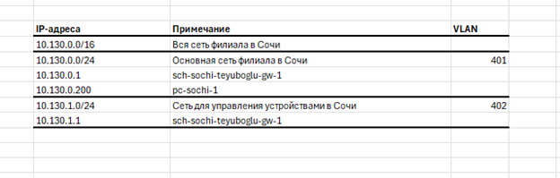{#fig:005 width=70%}

## Размещение оборудования

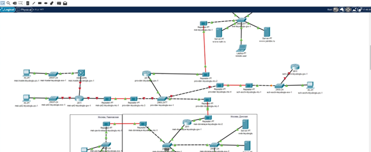{#fig:006 width=70%}

## Замена модулей

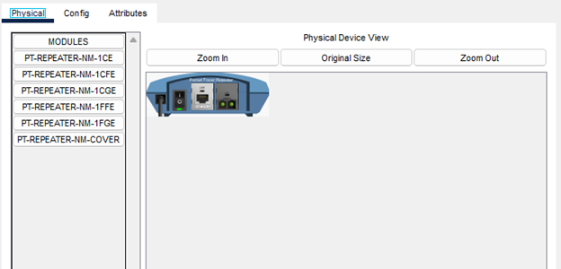{#fig:007 width=70%}

## Добавление интерфейса

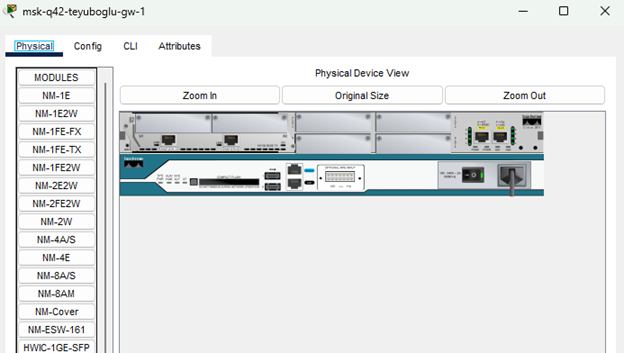{#fig:008 width=70%}

## Физическая рабочая область

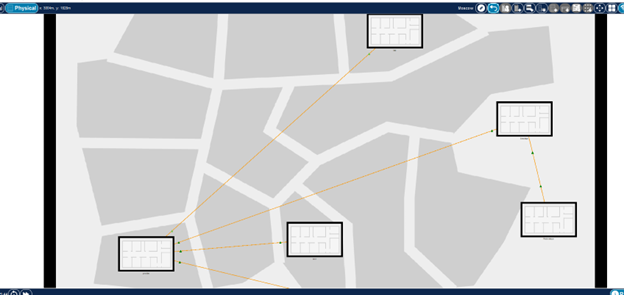{#fig:009 width=70%}

## Физическая рабочая область

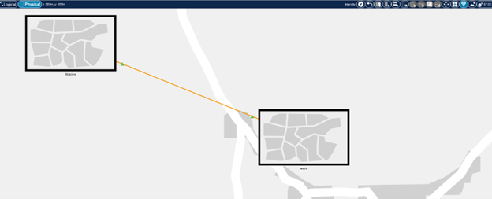{#fig:010 width=70%}

## Физическая рабочая область

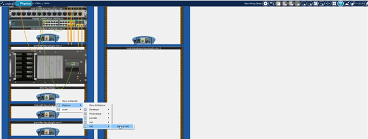{#fig:011 width=70%}

## Физическая рабочая область

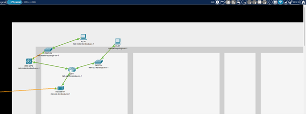{#fig:012 width=70%}

## Физическая рабочая область

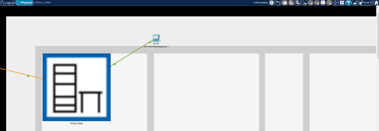{#fig:013 width=70%}

## Первоначальная настройка

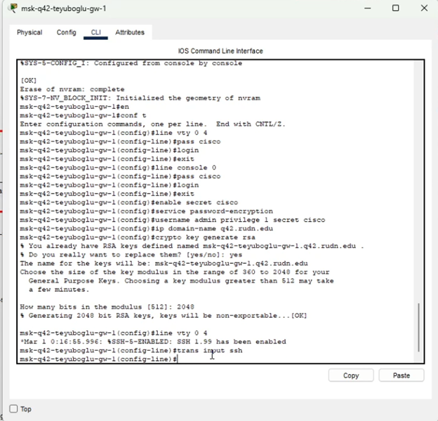{#fig:014 width=70%}

## Первоначальная настройка

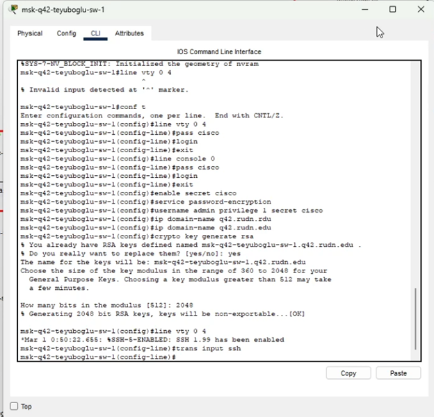{#fig:015 width=70%}

## Первоначальная настройка

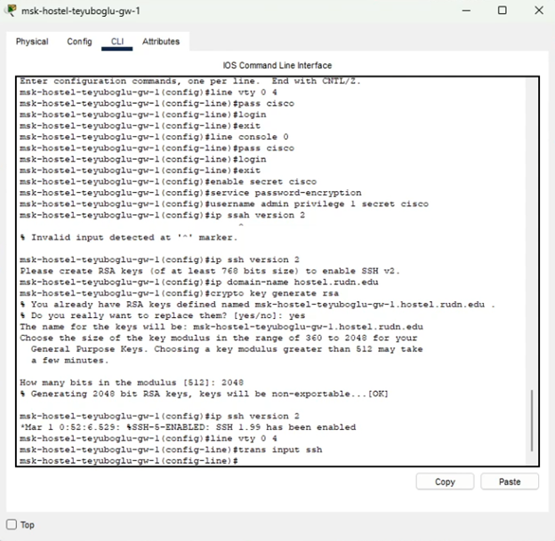{#fig:016 width=70%}

## Первоначальная настройка

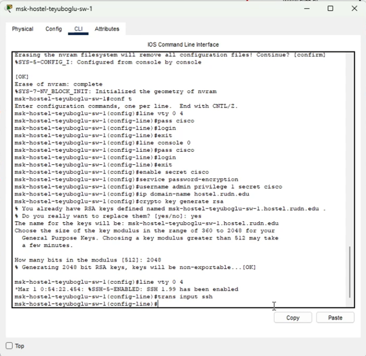{#fig:017 width=70%}

## Первоначальная настройка

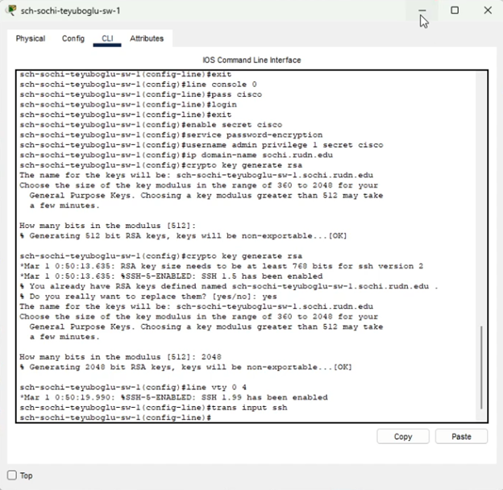{#fig:018 width=70%}

## Первоначальная настройка

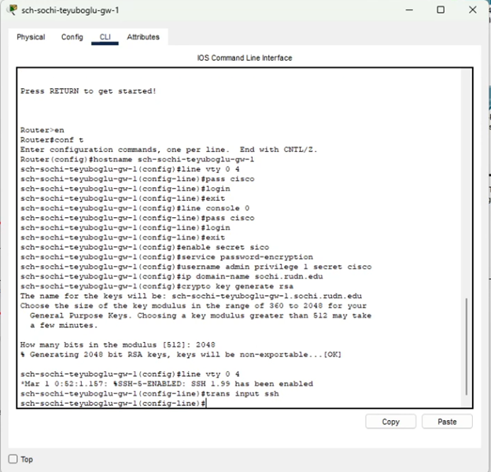{#fig:019 width=70%}

# Выводы по проделанной работе

## Выводы

В ходе выполнения лабораторной работы мы провели подготовительные мероприятия по организации взаимодействия через сеть провайдера посредством статической маршрутизации локальной сети с сетью основного здания, расположенного в 42-м квартале в Москве, и сетью филиала, расположенного в г. Сочи.