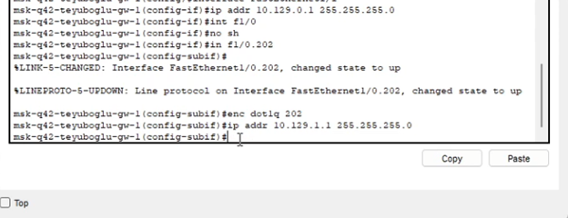

---
## Front matter
lang: ru-RU
title: Презентация по лабораторной работе №14
subtitle: ""
author:
  - Еюбоглу Тимур
institute:
  - Российский университет дружбы народов, Москва, Россия

## i18n babel
babel-lang: russian
babel-otherlangs: english

## Formatting pdf
toc: false
toc-title: Содержание
slide_level: 2
aspectratio: 169
section-titles: true
theme: metropolis
header-includes:
 - \metroset{progressbar=frametitle,sectionpage=progressbar,numbering=fraction}
 - '\makeatletter'
 - '\makeatother'
---

## Докладчик

  * Еюбоглу Тимур
  * 1032224357
  * уч. группа: НПИбд-01-22
  * Факультет физико-математических и естественных наук
  * Российский университет дружбы народов

# Цель и задачи

## Цель и задания лабораторной работы

Настроить взаимодействие через сеть провайдера посредством статической маршрутизации локальной сети организации с сетью основного здания, расположенного в 42-м квартале в Москве, и сетью филиала, расположенного в г. Сочи.

## Задачи

1. Настроить связь между территориями (см. раздел 14.3.1).
2. Настроить оборудование, расположенное в квартале 42 в Москве (см. раздел 14.3.2).
3. Настроить оборудование, расположенное в филиале в г. Сочи (см. раздел 14.3.3).
4. Настроить статическую маршрутизацию между территориями (см. раздел 14.3.4).
5. Настроить статическую маршрутизацию на территории квартала 42 в г. Москве (см. раздел 14.3.5).
6. Настроить NAT на маршрутизаторе msk-donskaya-gw-1 (см. раздел 14.3.6).
7. При выполнении работы необходимо учитывать соглашение об именовании (см. раздел 2.5).

# Процесс выполнения лабораторной работы

## Настройка интерфейсов коммутатора provider-sw-1 

{#fig:001 width=70%}

## Настройка интерфейсов маршрутизатора msk-donskaya-gw-1 

{#fig:002 width=70%}

## Настройка интерфейсов маршрутизатора msk-q42-gw-1 

{#fig:003 width=70%}

## Настройка интерфейсов маршрутизатора msk-q42-gw-1 

{#fig:004 width=70%}

## Настройка интерфейсов коммутатора sch-sochi-sw-1 

{#fig:005 width=70%}

## Настройка интерфейсов маршрутизатора sch-sochi-gw-1 

{#fig:006 width=70%}

## Настройка площадки 42-го квартала. Настройка интерфейсов коммутатора msk-q42-sw-1 

{#fig:007 width=70%}

## Настройка интерфейсов маршрутизирующего коммутатора msk-hostel-gw-1 

{#fig:008 width=70%}

## Настройка интерфейсов маршрутизирующего коммутатора msk-hostel-gw-1 

{#fig:009 width=70%}

## Настройка интерфейсов маршрутизирующего коммутатора msk-hostel-gw-1 

{#fig:010 width=70%}

## Настройка интерфейсов коммутатора msk-hostel-sw-1 

{#fig:011 width=70%}

## Настройка площадки в Сочи. Настройка интерфейсов маршрутизатора sch-sochi-gw-1 

{#fig:012 width=70%}

## Настройка интерфейсов коммутатора sch-sochi-sw-1 

{#fig:013 width=70%}

## Настройка маршрутизации между площадками. Настройка маршрутизатора msk-donskaya-gw-1 

{#fig:014 width=70%}

## Настройка маршрутизатора msk-q42-gw-1 

{#fig:015 width=70%}

## Настройка маршрутизатора sch-sochi-gw-1 

{#fig:016 width=70%}

## Настройка маршрутизации на 42 квартале.  Настройка маршрутизатора msk-q42-gw-1 

{#fig:017 width=70%}

## Настройка интерфейсов маршрутизирующего коммутатора msk-hostel-gw-1 

{#fig:018 width=70%}

## Настройка NAT на маршрутизаторе msk-donskaya-gw-1 

{#fig:019 width=70%}

## Конфигурация IP для оконеченных устройств. 

{#fig:020 width=70%}

## Конфигурация IP для оконеченных устройств. 

{#fig:021 width=70%}

## Конфигурация IP для оконеченных устройств. 

{#fig:022 width=70%}

## Проверка с помощью команды ping 

{#fig:023 width=70%}

## Проверка с помощью команды ping 

{#fig:024 width=70%}

## Проверка с помощью команды ping 

{#fig:025 width=70%}

# Выводы по проделанной работе

## Выводы

Благодаря выполнению данной лабораторной работы мы настроили взаимодействие через сеть провайдера посредством статической маршрутизации локальной сети организации с сетью основного здания, расположенного в 42-м квартале в Москве, и сетью филиала, расположенного в г. Сочи.