---
## Front matter
title: "Отчет по лабораторной работе №14"
subtitle: "Администрирование локальных сетей"
author: "Еюбоглу Тимур, НПИбд-01-22"

## Generic otions
lang: ru-RU
toc-title: "Содержание"

## Bibliography
bibliography: bib/cite.bib
csl: pandoc/csl/gost-r-7-0-5-2008-numeric.csl

## Pdf output format
toc: true # Table of contents
toc-depth: 2
lof: true # List of figures
lot: false # List of tables
fontsize: 12pt
linestretch: 1.5
papersize: a4
documentclass: scrreprt
## I18n polyglossia
polyglossia-lang:
  name: russian
  options:
	- spelling=modern
	- babelshorthands=true
polyglossia-otherlangs:
  name: english
## I18n babel
babel-lang: russian
babel-otherlangs: english
## Fonts
mainfont: IBM Plex Serif
romanfont: IBM Plex Serif
sansfont: IBM Plex Sans
monofont: IBM Plex Mono
mathfont: STIX Two Math
mainfontoptions: Ligatures=Common,Ligatures=TeX,Scale=0.94
romanfontoptions: Ligatures=Common,Ligatures=TeX,Scale=0.94
sansfontoptions: Ligatures=Common,Ligatures=TeX,Scale=MatchLowercase,Scale=0.94
monofontoptions: Scale=MatchLowercase,Scale=0.94,FakeStretch=0.9
mathfontoptions:
## Biblatex
biblatex: true
biblio-style: "gost-numeric"
biblatexoptions:
  - parentracker=true
  - backend=biber
  - hyperref=auto
  - language=auto
  - autolang=other*
  - citestyle=gost-numeric
## Pandoc-crossref LaTeX customization
figureTitle: "Рис."
tableTitle: "Таблица"
listingTitle: "Листинг"
lofTitle: "Список иллюстраций"
lotTitle: "Список таблиц"
lolTitle: "Листинги"
## Misc options
indent: true
header-includes:
  - \usepackage{indentfirst}
  - \usepackage{float} # keep figures where there are in the text
  - \floatplacement{figure}{H} # keep figures where there are in the text
---

# Цель работы

Настроить взаимодействие через сеть провайдера посредством статической маршрутизации локальной сети организации с сетью основного здания, расположенного в 42-м квартале в Москве, и сетью филиала, расположенного в г. Сочи.

# Задание

1. Настроить связь между территориями (см. раздел 14.3.1).
2. Настроить оборудование, расположенное в квартале 42 в Москве (см. раздел 14.3.2).
3. Настроить оборудование, расположенное в филиале в г. Сочи (см. раздел 14.3.3).
4. Настроить статическую маршрутизацию между территориями (см. раздел 14.3.4).
5. Настроить статическую маршрутизацию на территории квартала 42 в г. Москве (см. раздел 14.3.5).
6. Настроить NAT на маршрутизаторе msk-donskaya-gw-1 (см. раздел 14.3.6).
7. При выполнении работы необходимо учитывать соглашение об именовании (см. раздел 2.5).

# Выполнение лабораторной работы

Настройка интерфейсов коммутатора provider-sw-1 (рис. [-@fig:001]).

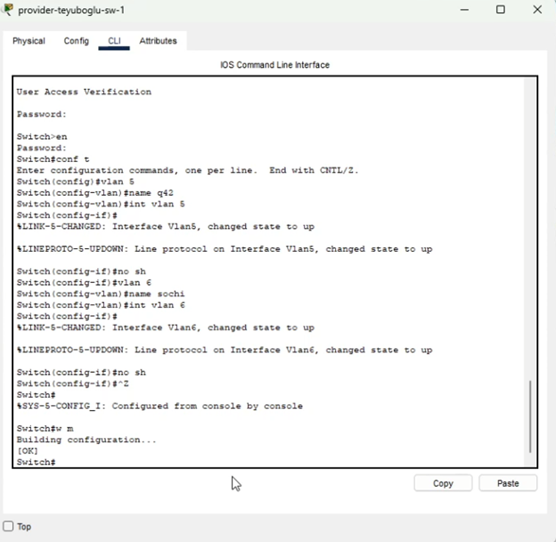{#fig:001 width=70%}

Настройка интерфейсов маршрутизатора msk-donskaya-gw-1 (рис. [-@fig:002]).

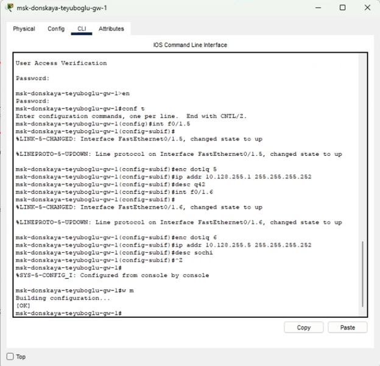{#fig:002 width=70%}

Настройка интерфейсов маршрутизатора msk-q42-gw-1 (рис. [-@fig:003]) (рис. [-@fig:004]).

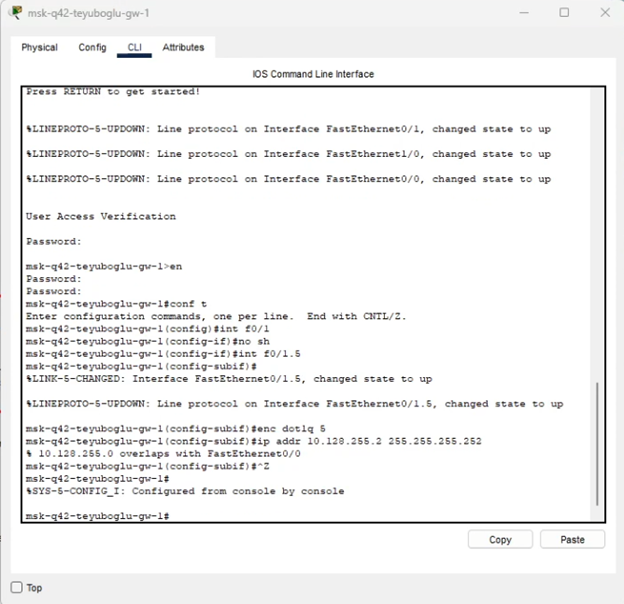{#fig:003 width=70%}

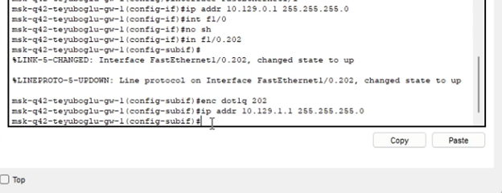{#fig:004 width=70%}

Настройка интерфейсов коммутатора sch-sochi-sw-1 (рис. [-@fig:005]).

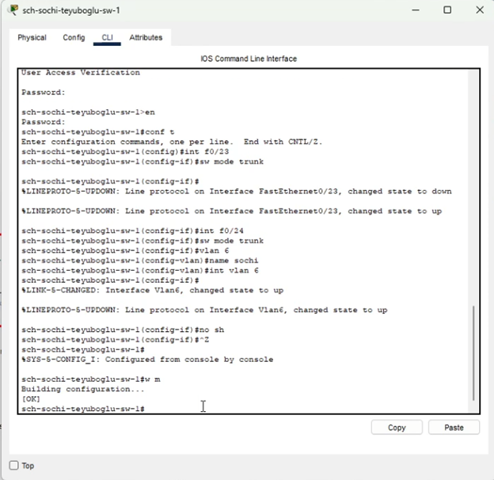{#fig:005 width=70%}

Настройка интерфейсов маршрутизатора sch-sochi-gw-1 (рис. [-@fig:006]).

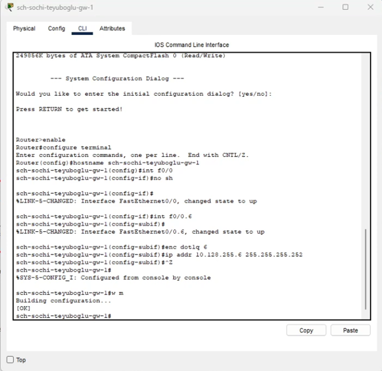{#fig:006 width=70%}

Настройка площадки 42-го квартала. Настройка интерфейсов коммутатора msk-q42-sw-1 (рис. [-@fig:007]).

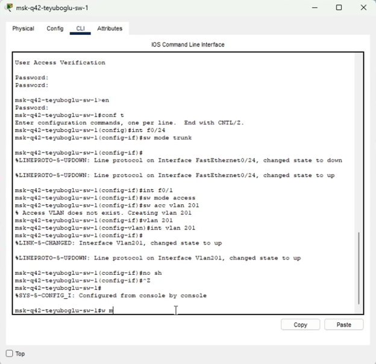{#fig:007 width=70%}

Настройка интерфейсов маршрутизирующего коммутатора msk-hostel-gw-1 (рис. [-@fig:008]) (рис. [-@fig:009]) (рис. [-@fig:010]).

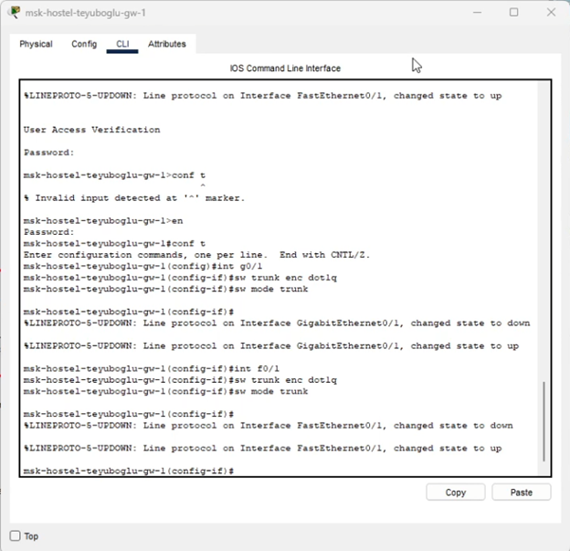{#fig:008 width=70%}

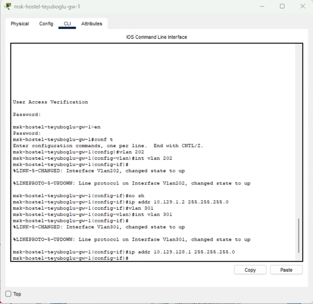{#fig:009 width=70%}

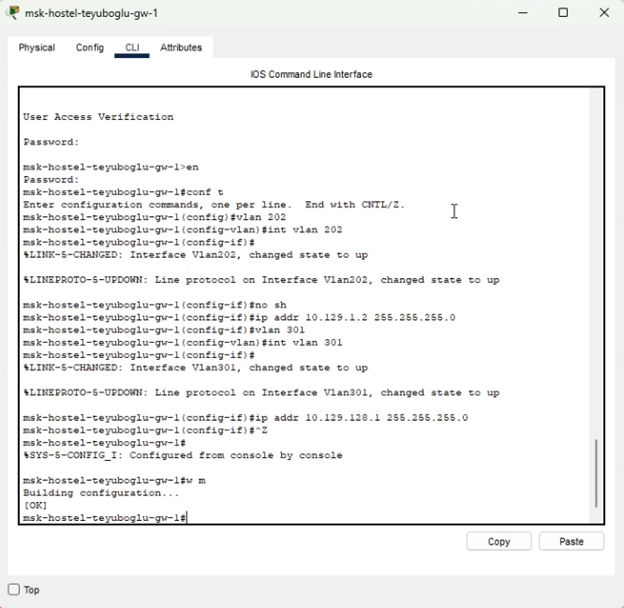{#fig:010 width=70%}

Настройка интерфейсов коммутатора msk-hostel-sw-1 (рис. [-@fig:011]).

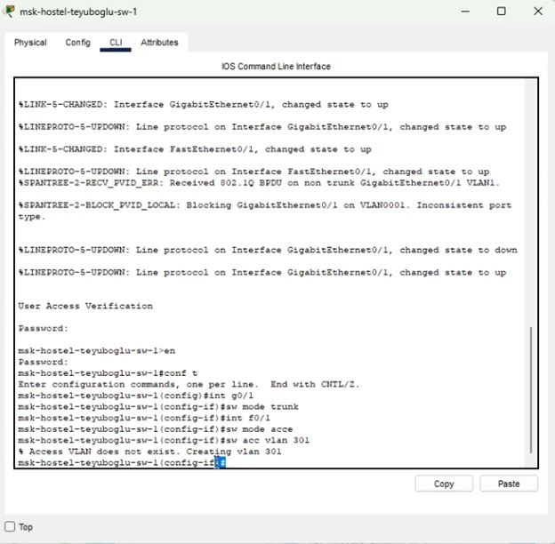{#fig:011 width=70%}

Настройка площадки в Сочи. Настройка интерфейсов маршрутизатора sch-sochi-gw-1 (рис. [-@fig:012]).

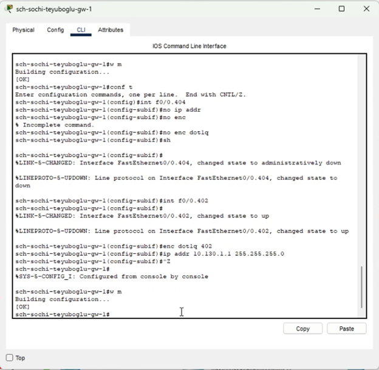{#fig:012 width=70%}

Настройка интерфейсов коммутатора sch-sochi-sw-1 (рис. [-@fig:013]).

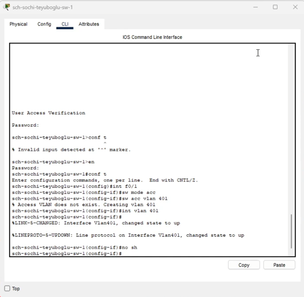{#fig:013 width=70%}

Настройка маршрутизации между площадками. Настройка маршрутизатора msk-donskaya-gw-1 (рис. [-@fig:014]).

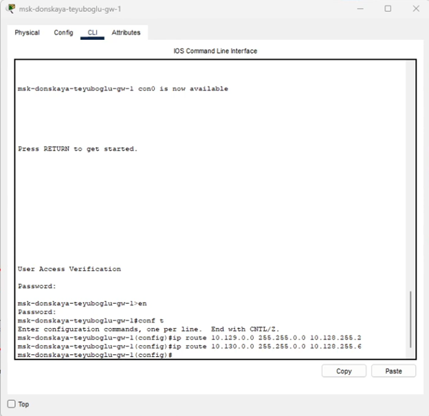{#fig:014 width=70%}

Настройка маршрутизатора msk-q42-gw-1 (рис. [-@fig:015]).

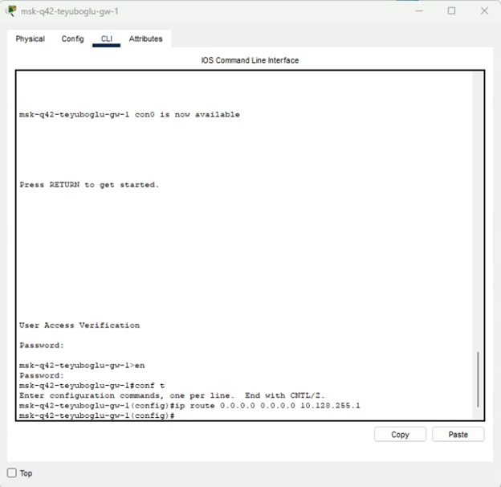{#fig:015 width=70%}

Настройка маршрутизатора sch-sochi-gw-1 (рис. [-@fig:016]).

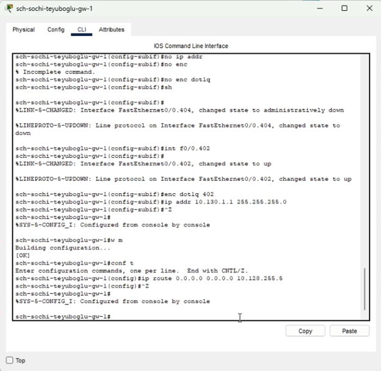{#fig:016 width=70%}

Настройка маршрутизации на 42 квартале.  Настройка маршрутизатора msk-q42-gw-1 (рис. [-@fig:017]).

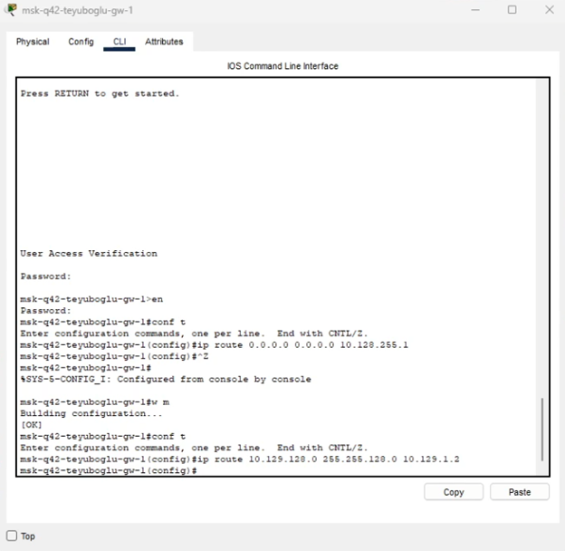{#fig:017 width=70%}

Настройка интерфейсов маршрутизирующего коммутатора msk-hostel-gw-1 (рис. [-@fig:018]).

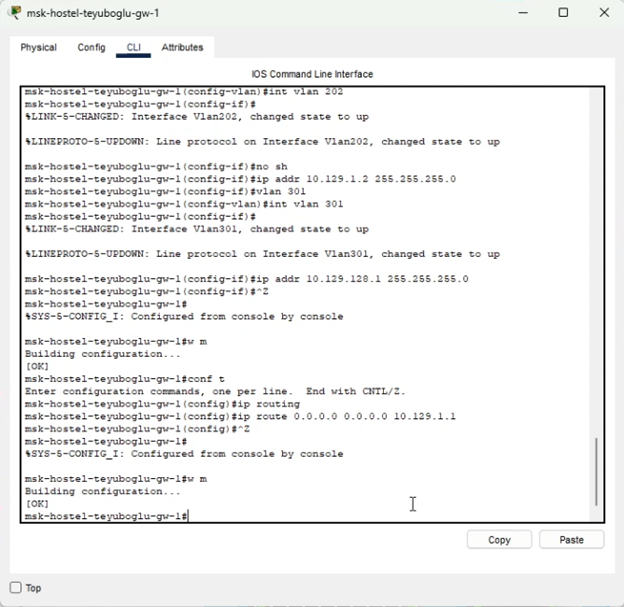{#fig:018 width=70%}

Настройка NAT на маршрутизаторе msk-donskaya-gw-1 (рис. [-@fig:019]).

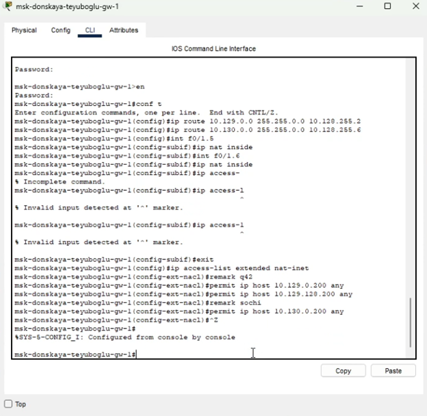{#fig:019 width=70%}

Конфигурация IP для оконеченных устройств. (рис. [-@fig:020]) (рис. [-@fig:021]) (рис. [-@fig:022]).

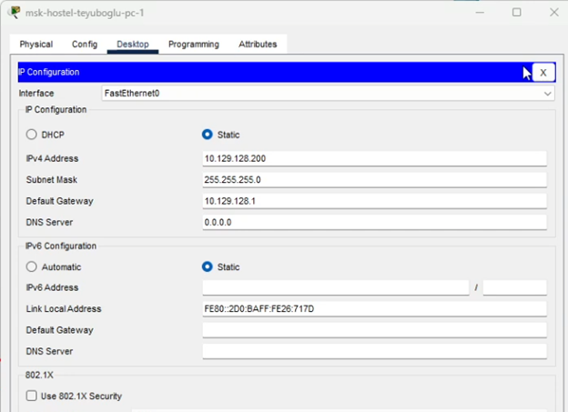{#fig:020 width=70%}

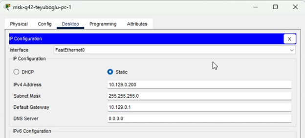{#fig:021 width=70%}

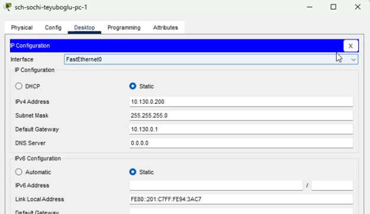{#fig:022 width=70%}

Проверка с помощью команды ping (рис. [-@fig:023]) (рис. [-@fig:024]) (рис. [-@fig:025]).

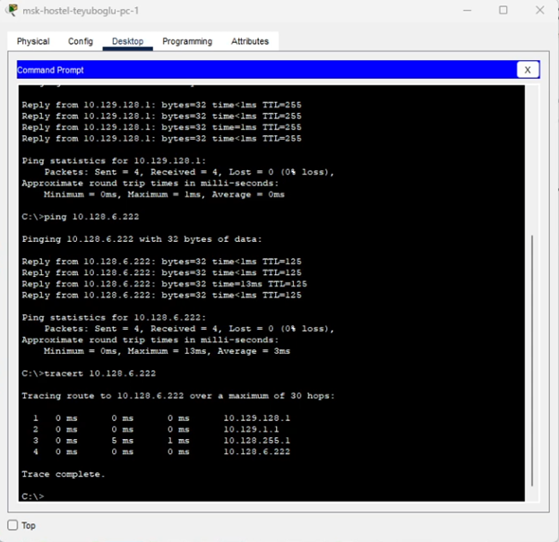{#fig:023 width=70%}

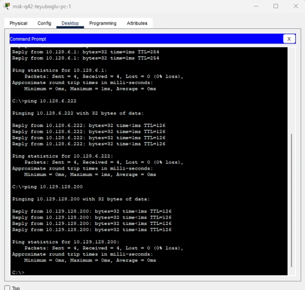{#fig:024 width=70%}

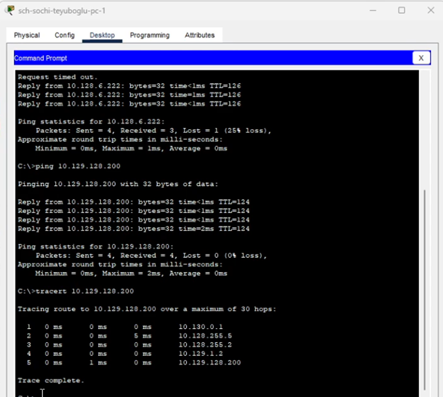{#fig:025 width=70%}

# Выводы

Благодаря выполнению данной лабораторной работы мы настроили взаимодействие через сеть провайдера посредством статической маршрутизации локальной сети организации с сетью основного здания, расположенного в 42-м квартале в Москве, и сетью филиала, расположенного в г. Сочи.

# Контрольные вопросы

Ответы на контрольные вопросы:
1. Приведите пример настройки статической маршрутизации между двумя подсетями организации. - Необходимо задать IP шлюзов на интерфейсах, настроить sub-интерфейсы с тегированием кадром VLAN'ами и своими IP, затем настроить статические маршруты между сетями.
2. Опишите процесс обращения устройства из одного VLAN к устройству из другого VLAN. - 1 устройство посылает фрейм на маршрутизатор, тот меняет MAC исходника на свой и перенаправляет фрейм 2 устройству.
3. Как проверить работоспособность маршрута? - ping на диаметрально противоположных устройствах друг к другу.
4. Как посмотреть таблицу маршрутизации? - show ip route