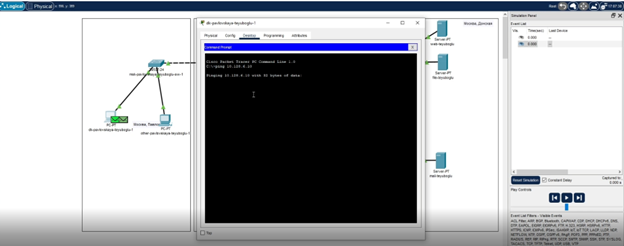

---
## Front matter
title: "Лабораторная работа 6"
subtitle: "Статическая маршрутизация VLAN"
author: "Еюбоглу Тимур"

## Generic otions
lang: ru-RU
toc-title: "Содержание"

## Bibliography
bibliography: bib/cite.bib
csl: pandoc/csl/gost-r-7-0-5-2008-numeric.csl

## Pdf output format
toc: true # Table of contents
toc-depth: 2
lof: true # List of figures
lot: true # List of tables
fontsize: 12pt
linestretch: 1.5
papersize: a4
documentclass: scrreprt
## I18n polyglossia
polyglossia-lang:
  name: russian
  options:
	- spelling=modern
	- babelshorthands=true
polyglossia-otherlangs:
  name: english
## I18n babel
babel-lang: russian
babel-otherlangs: english
## Fonts
mainfont: IBM Plex Serif
romanfont: IBM Plex Serif
sansfont: IBM Plex Sans
monofont: IBM Plex Mono
mathfont: STIX Two Math
mainfontoptions: Ligatures=Common,Ligatures=TeX,Scale=0.94
romanfontoptions: Ligatures=Common,Ligatures=TeX,Scale=0.94
sansfontoptions: Ligatures=Common,Ligatures=TeX,Scale=MatchLowercase,Scale=0.94
monofontoptions: Scale=MatchLowercase,Scale=0.94,FakeStretch=0.9
mathfontoptions:
## Biblatex
biblatex: true
biblio-style: "gost-numeric"
biblatexoptions:
  - parentracker=true
  - backend=biber
  - hyperref=auto
  - language=auto
  - autolang=other*
  - citestyle=gost-numeric
## Pandoc-crossref LaTeX customization
figureTitle: "Рис."
tableTitle: "Таблица"
listingTitle: "Листинг"
lofTitle: "Список иллюстраций"
lotTitle: "Список таблиц"
lolTitle: "Листинги"
## Misc options
indent: true
header-includes:
  - \usepackage{indentfirst}
  - \usepackage{float} # keep figures where there are in the text
  - \floatplacement{figure}{H} # keep figures where there are in the text
---

# Цель работы

Настроить статическую маршрутизацию VLAN в сети.

# Задание

1. Добавить в локальную сеть маршрутизатор, провести его первоначальную
настройку.
2. Настроить статическую маршрутизацию VLAN.
3. При выполнении работы необходимо учитывать соглашение об именовании
(см. раздел 2.5).

# Выполнение лабораторной работы

1. В логической области проекта размещаем маршрутизатор Cisco 2811, подключаем его к порту 24 коммутатора msk-donskaya-teyuboglu-sw-1, в соответствии с таблицей портов (рис. [-@fig:001]).
   
{#fig:001 width=70%}

2. Используя приведённую ниже последовательность команд по первоначальной настройке маршрутизатора, сконфигурируем маршрутизатор, задав на нём имя, пароль для доступа к консоли, настройте удалённое подключение к нему по ssh.
  
3. Настраиваем порт 24 коммутатора msk-donskaya-teyuboglu-sw-1 (рис. [-@fig:002]).

{#fig:002 width=70%}

4. На интерфейсе f0/0 маршрутизатора msk-donskaya-teyuboglu-gw-1 настроим виртуальные интерфейсы, соответствующие номерам VLAN. Согласно таблице IP-адресов (см. табл. 3.2 из раздела 3.3) задаем соответствующие IPадреса на виртуальных интерфейсах. Для этого используем приведённую ниже последовательность команд по конфигурации VLAN-интерфейсов маршрутизатора (рис. [-@fig:003]) (рис. [-@fig:004]).

{#fig:003 width=70%}

{#fig:004 width=70%}

5. Проверяем доступность оконечных устройств из разных Vlan (рис. [-@fig:005]). 

{#fig:005 width=70%}

6. Используя режим симуляции в Packet Tracer, изучаем процесс передвижения пакета ICMP по сети. Изучаем содержимое передаваемого пакета и заголовки задействованных протоколов (рис. [-@fig:006]) (рис. [-@fig:007]).
   
{#fig:006 width=70%}

{#fig:007 width=70%}

# Конфигурация устройств

msk-donskaya-teyuboglu-gw-1#show running-config
Building configuration...

Current configuration : 1500 bytes
!
version 15.1
no service timestamps log datetime msec
no service timestamps debug datetime msec
service password-encryption
!
hostname msk-donskaya-teyuboglu-gw-1
!
!
!
enable secret 5 $1$mERr$hx5rVt7rPNoS4wqbXKX7m0
!
!
!
!
!
!
ip cef
no ipv6 cef
!
!
!
username admin secret 5 $1$mERr$hx5rVt7rPNoS4wqbXKX7m0
!
!
license udi pid CISCO2811/K9 sn FTX10178MO4-
!
!
!
!
!
!
!
!
!
ip ssh version 1
ip domain-name donskaya.rudn.edu
!
!
spanning-tree mode pvst
!
!
!
!
!
!
interface FastEthernet0/0
 no ip address
 duplex auto
 speed auto
!
interface FastEthernet0/0.2
 description managment
 encapsulation dot1Q 2
 ip address 10.128.1.1 255.255.255.0
!
interface FastEthernet0/0.3
 description servers
 encapsulation dot1Q 3
 ip address 10.128.0.1 255.255.255.0
!
interface FastEthernet0/0.101
 description dk
 encapsulation dot1Q 101
 ip address 10.128.3.1 255.255.255.0
!
interface FastEthernet0/0.102
 description departments
 encapsulation dot1Q 102
 ip address 10.128.4.1 255.255.255.0
!
interface FastEthernet0/0.103
 description adm
 encapsulation dot1Q 103
 ip address 10.128.5.1 255.255.255.0
!
interface FastEthernet0/0.104
 description other
 encapsulation dot1Q 104
 ip address 10.128.6.1 255.255.255.0
!
interface FastEthernet0/1
 no ip address
 duplex auto
 speed auto
 shutdown
!
interface Vlan1
 no ip address
 shutdown
!
ip classless
!
ip flow-export version 9
!
!
!
!
!
!
!
line con 0
 password 7 0822455D0A16
 login
!
line aux 0
!
line vty 0 4
 password 7 0822455D0A16
 login
!
!
!
end

# Контрольные вопросы

1.	Охарактеризуйте стандарт IEEE 802.1Q. 
Виртуальные локальные сети, построенные на основе стандарта IEEE 802.1Q, используют дополнительные поля кадра для хранения информации о принадлежности к VLAN при его перемещении по сети. С точки зрения удобства и гибкости настроек, VLAN стандарта IEEE 802.1Qявляется лучшим решением по сравнению с VLAN на основе портов. Его основные преимущества:
Гибкость и удобство в настройке и изменении — можно создавать необходимые комбинации VLAN как в пределах одного коммутатора, так и во всей сети, построенной на коммутаторах с поддержкой стандарта IEEE 802.1Q. Способность добавления тегов позволяет информации о VLAN распространяться через множество 802.1Q-совместимых коммутаторов по одному физическому соединению (магистральному каналу, Trunk Link);
Позволяет активизировать алгоритм связующего дерева (Spanning Tree) на всех портах и работать в обычном режиме. Протокол Spanning Tree оказывается весьма полезным для применения в крупных сетях, построенных на нескольких коммутаторах, и позволяет коммутаторам автоматически определять древовидную конфигурацию связей в сети при произвольном соединении портов между собой. Для нормальной работы коммутатора требуется отсутствие замкнутых маршрутов в сети. Эти маршруты могут создаваться администратором специально для образования резервных связей или же возникать случайным образом, что вполне возможно, если сеть имеет многочисленные связи, а кабельная система плохо структурирована или документирована. С помощью протокола Spanning Tree коммутаторы после построения схемы сети блокируют избыточные маршруты. Таким образом, автоматически предотвращается возникновение петель в сети;
Способность VLAN IEEE 802.1Q добавлять и извлекать теги из заголовков кадров позволяет использовать в сети коммутаторы и сетевые устройства, которые не поддерживают стандарт IEEE 802.1Q;
Устройства разных производителей, поддерживающие стандарт, могут работать вместе, независимо от какого-либо фирменного решения;
Чтобы связать подсети на сетевом уровне, необходим маршрутизатор или коммутатор L3. Однако для более простых случаев, например, для организации доступа к серверу из различных VLAN, маршрутизатор не потребуется. Нужно включить порт коммутатора, к которому подключен сервер, во все подсети, а сетевой адаптер сервера должен поддерживать стандарт IEEE 802.1Q.

2.	Опишите формат кадра IEEE 802.1Q.
К кадру Ethernet добавлены 32 бита (4 байта), которые увеличивают его размер до 1522 байт. Первые 2 байта (поле Tag Protocol Identifier, TPID) с фиксированным значением 0х8100 определяют, что кадр содержит тег протокола 802.1Q. Остальные 2 байта содержат следующую информацию:
•	Priority ("Приоритет") — 3 бита поля приоритета передачи кодируют до восьми уровней приоритета (от 0 до 7, где 7 — наивысший приоритет), которые используются в стандарте 802.1р;
•	Canonical Format Indicator (CFI) — 1 бит индикатора канонического формата зарезервирован для обозначения кадров сетей других типов (Token Ring, FDDI), передаваемых по магистрали Ethernet;
•	VID (VLAN ID) — 12-битный идентификатор VLAN определяет, какой VLAN принадлежит трафик. Поскольку под поле VID отведено 12 бит, то можно задать 4094 уникальных VLAN (VID 0 и VID 4095 зарезервированы).

# Выводы

Благодаря выполнению данной лабораторной работы, мы научились настраивать статическую маршрутизацию VLAN в сети.
